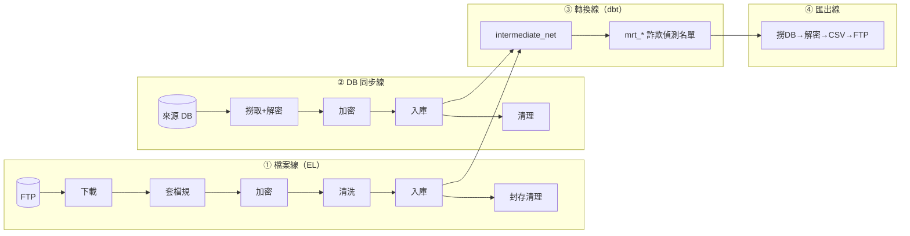

# 00 · 系統架構總覽

第一次接觸這套系統的人請先看完這篇。

---

## 1. 四個角色

| 角色 | 位置 | 負責什麼 | 碰得到資料嗎 |
|---|---|---|---|
| **VM4（Dagster）** | 跑 webserver / daemon / code server 的容器 | 排程、判斷相依性、發指令、收 log | ❌ 不碰檔案內容 |
| **VM1（Runner）** | `10.10.159.74`，帳號 `bcp_runner` | 連 FTP、解壓縮、套檔規、加解密、清洗、BCP、匯出 | ✅ 全部都碰 |
| **dbt 容器** | 由 Dagster 動態啟動，映像 `dai/dagster:v2.6` | 執行 `dbt build` / `dbt snapshot` | ✅ 透過 SQL |
| **SQL Server** | `10.10.20.92:1433`，DB `DDEQDTAI` | 資料倉儲本體 | — |

**為什麼要這樣切？** 敏感資料只在 VM1 落地並加密，Dagster 全程只送指令、收結果。指令用 `shlex.quote()` 逐一跳脫，避免任何設定值被當成 shell 指令執行。

---

## 2. 四條資料線



| 線 | 來源 | 誰啟動它 | 設定檔 |
|---|---|---|---|
| ① 檔案線 | FTP 或落地目錄的 CSV/ZIP | 檔案偵測 sensor | `table_mapping.py` → `TABLE_CSV_MAPPING` |
| ② DB 同步線 | 對方的 SQL Server | 筆數穩定 sensor | `db_sync/config.py` → `DB_SYNC_MAPPING` |
| ③ 轉換線 | 我方 DB 的 `T_*` 表 | 上游做完自動觸發 | `dbt_project/models/*.sql` |
| ④ 匯出線 | 我方 DB 的 `mrt_*` 表 | dbt 做完自動觸發 | `table_mapping.py` → `SQL_TO_CSV_MAPPING` |

**目前規模**：15 張來源表、1 張 DB 同步表、37 支 dbt 模型（alias 成 `mrt_*`）+ 2 支中介表、2 支快照、7 個匯出。

---

## 3. 資產（Asset）命名規則

Dagster 把每個處理步驟叫做一個「資產」，UI 上顯示成 `前綴/名稱`。

### 檔案線（一張表最多 6 個節點）

```
file_system/<表名>_fetch_ftp        ← 有設 use_ftp_fetch 才建立
file_system/<表名>_named            ← 有設 use_data_rule 才建立
file_system/<表名>_encrypted        ← 有設 encrypt_fields 才建立
file_system/<表名>_clean            ← 有設 has_clean_func 才建立
database/<表名>                     ← 一定會建立（BCP 入庫）
file_system/<表名>_archive_cleanup  ← 有設 use_ftp_fetch 才建立
```

沒開的節點會自動跳過，鏈子不會斷——每個節點的上游是「往前找第一個有開的節點」。

### 其他三條線

| 線 | 資產名稱 | 群組 |
|---|---|---|
| DB 同步 | `file_system/<表名>_db_extract`、`file_system/<表名>_encrypted`、`database/<表名>`、`file_system/<表名>_cleanup` | `db_sync` |
| dbt | `<模型檔名>`（不含 `.sql`） | `fraud_detection_models` / `intermediate_tables` / `snapshots` |
| 匯出 | `export/<設定檔的 key>` | `export_to_csv` |

### ⚠️ 最常搞混的一件事

**dbt 的資產名稱用「檔名」，不是 `alias`。**

以 `models/ATM_C2.sql`（裡面寫 `alias='mrt_ATM_C2'`）為例：

| 場合 | 要用什麼 |
|---|---|
| Dagster UI 上的資產名稱 | `ATM_C2`（檔名） |
| 別的模型引用它 `ref('...')` | `ATM_C2`（檔名） |
| 匯出設定的 `depends_on_dbt_model` | `ATM_C2`（檔名） |
| 資料庫裡實際的表名 | `mrt_ATM_C2`（alias） |
| 匯出設定的 `source_table` | `mrt_ATM_C2`（alias） |

---

## 4. 檔案線各階段的檔名變化

以 `template = "T_TXN_PS_{date}.csv"`、日期 `2026-08-01` 為例：

| 階段 | 檔案位置 |
|---|---|
| FTP 上的原始檔 | `<ftp_remote_dir>/T_TXN_PS_20260801*.zip` |
| 下載落地（有加密欄位時進暫存區） | `~/<staging_subfolder>/T_TXN_PS_20260801.csv` |
| 套檔規後 | `~/<staging_subfolder>/T_TXN_PS_20260801_NAMED.csv` |
| 加密後（固定寫回 `input_folder`） | `<input_folder>/T_TXN_PS_20260801_ENCRYPTED.csv` |
| 清洗後 | `<output_folder>/T_TXN_PS_20260801_CLEAN.csv` |
| BCP 讀取 | 上面「最後一個有開的階段」的產物 |
| 錯誤 log | `<output_folder>/bcp_error_logs/T_TXN_PS_error_20260801.log` |
| 封存 | `<archive_dir>/`（只留一個 zip，其餘中繼檔刪掉） |

月檔（`freq="monthly"`）的日期格式是 `YYYYMM`（6 碼），分區日期固定是該月 1 號。

---

## 5. 入庫節點順帶做的事

`database/<表名>` 不只是 BCP，順序是：

1. **確保下個月的分區存在**（`use_partition=True` 時）
2. **淘汰過期分區**（同時設了 `retention_years` 和 `archive_table` 時）
3. **停用索引 → BCP 匯入 → 重建索引**（`use_index=True` 時）

第 1、2、3 的 DDL 是 Dagster 容器直接連資料庫執行的；BCP 本身是 SSH 到 VM1 跑。

---

## 6. 編譯後的 SQL 去哪裡看

dbt 模型裡寫的是樣板語法（`{{ var("target_date") }}`、`{{ ref() }}`），實際送給資料庫的 SQL 在 `dbt_project/target/`：

| 目錄 | 內容 | 什麼時候看它 |
|---|---|---|
| `target/compiled/post_office_dbt/models/<模型>.sql` | **變數已帶入的純 SELECT** | 要複製到 SSMS 手動驗證邏輯 |
| `target/run/post_office_dbt/models/<模型>.sql` | 再包上建表/增量邏輯的**實際 DDL/DML** | 要查「為什麼資料沒進去」 |
| `target/manifest.json` | Dagster 靠這份產生 dbt 資產 | 新增模型後沒更新它，UI 上就看不到 |
| `target/run_results.json` | 上次執行的狀態與耗時 | 查哪一支慢、哪一支失敗 |

**在 VM4 上的實際路徑**：
```
/data/deploy/workspace/dagster_workspace/dbt_project/target/compiled/post_office_dbt/models/ATM_C2.sql
```

**要產生指定日期的編譯結果**（只編譯不執行，安全）：
```bash
docker run --rm \
  -v /data/deploy/workspace/dagster_workspace/dbt_project:/app/workspace/dbt_project \
  -w /app/workspace/dbt_project \
  --network docker-compose_vm4-network \
  dai/dagster:v2.6 \
  dbt compile --select ATM_C2 --vars '{"target_date": "2026-08-01"}' --profiles-dir .
```

> ⚠️ `target/` 每次執行都會被覆寫，只留最後一次。要保存某天的 SQL 請自己複製出來。

---

## 7. VM1 上的腳本

放在 VM1 的 `/home/bcp_runner/scripts/`：

| 腳本 | 被哪個資產呼叫 | 做什麼 |
|---|---|---|
| `list_ftp_remote.py` | sensor | 列 FTP 目錄 |
| `fetch_ftp_remote.py` | `*_fetch_ftp` | 下載、多檔合併、解密 zip |
| `assign_columns_remote.py` | `*_named` | 依檔規補欄位名 |
| `encrypt_remote.py` | `*_encrypted` | 欄位加密 |
| `clean_remote.py` | `*_clean` | 依表名分派到 `clean_functions/` 底下的清洗函式 |
| `bcp_remote.py` | `database/*` | BCP 匯入 |
| `archive_cleanup_remote.py` | `*_archive_cleanup` / `*_cleanup` | 刪暫存、封存 |
| `export_remote.py` | `export/*` | 撈 DB、解密、寫 CSV、送 FTP |
| `check_source_db.py` | DB 同步 sensor | 查來源批次筆數 |
| `extract_source_db.py` | `*_db_extract` | 撈來源 DB 並解密 |

另有 `/home/bcp_runner/scripts/clean_functions/`，每張表一支清洗函式，詳見 [03_新增一張資料表](./日常維運/03_新增一張資料表.md)。

---

## 8. 觸發機制一覽

| 觸發者 | 頻率 | 觸發什麼 |
|---|---|---|
| 檔案偵測 sensor（日檔 / 月檔各一支） | 離峰 30 秒 / 其他時段 5 分鐘 | 檔案線整條鏈 |
| DB 同步 sensor | 5 分鐘 | DB 同步線四個節點 |
| 自動觸發 sensor | 30 秒 | dbt 模型、匯出（上游好了就跑） |
| 失敗告警 sensor | 事件驅動 | 寫錯誤 log |
| 人工在 UI 點 Materialize | — | 任何資產 |

想看整套系統串起來的樣子，左邊選單點 **Lineage** 就有一張以群組為單位的鳥瞰圖：


細節與調整方式見 [10_Sensor掃描頻率與觸發邏輯](./進階調整/10_Sensor掃描頻率與觸發邏輯.md)。
