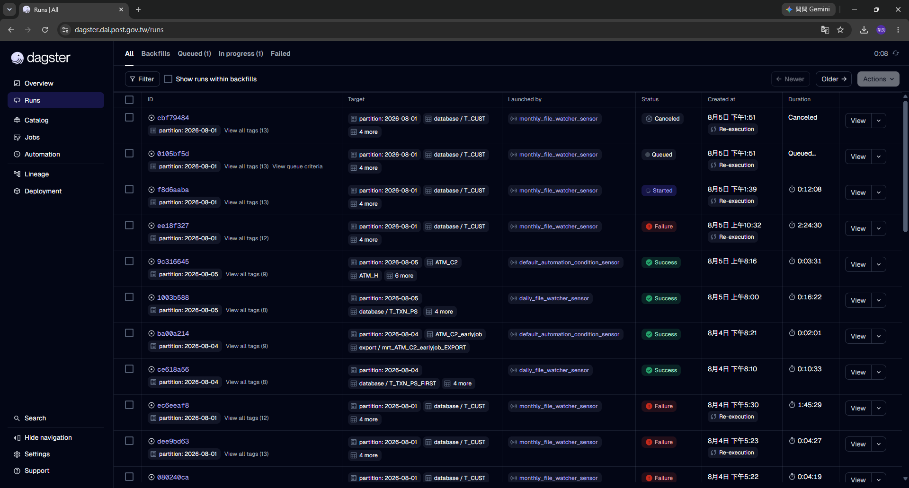
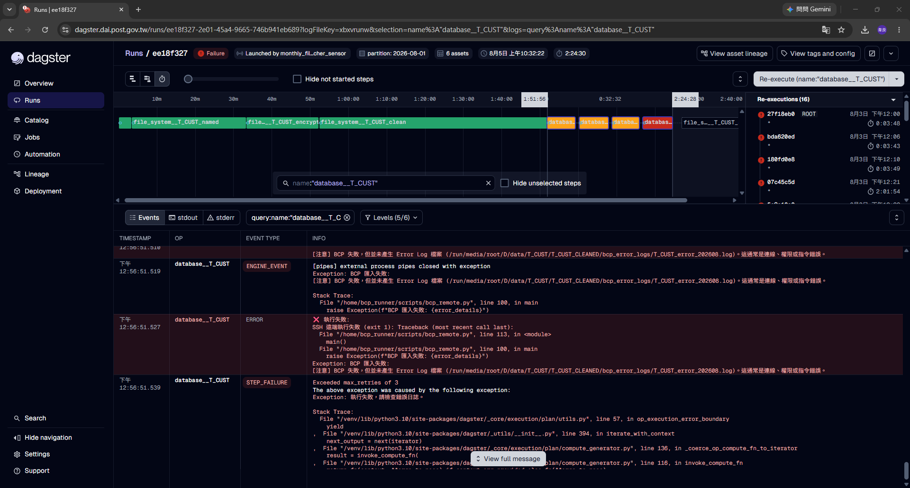
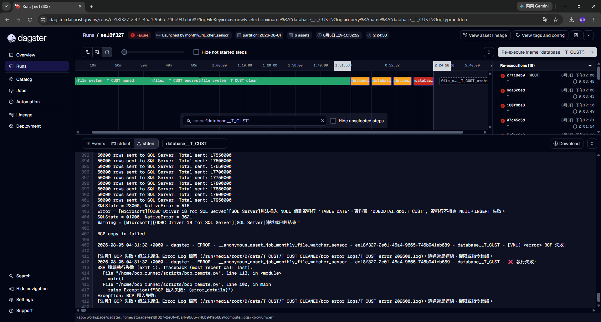
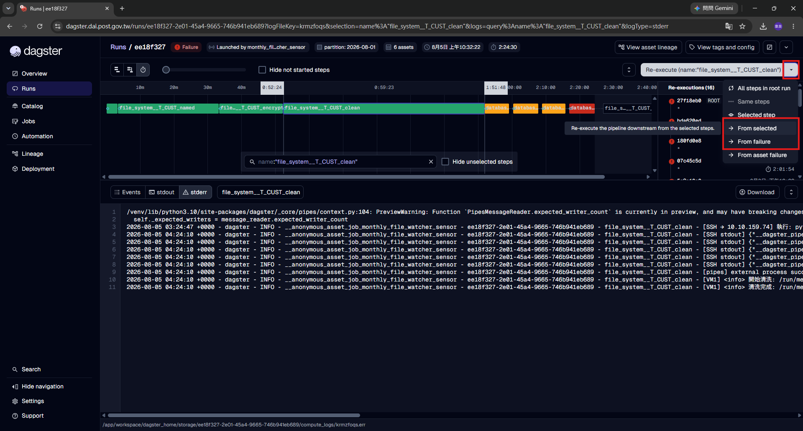
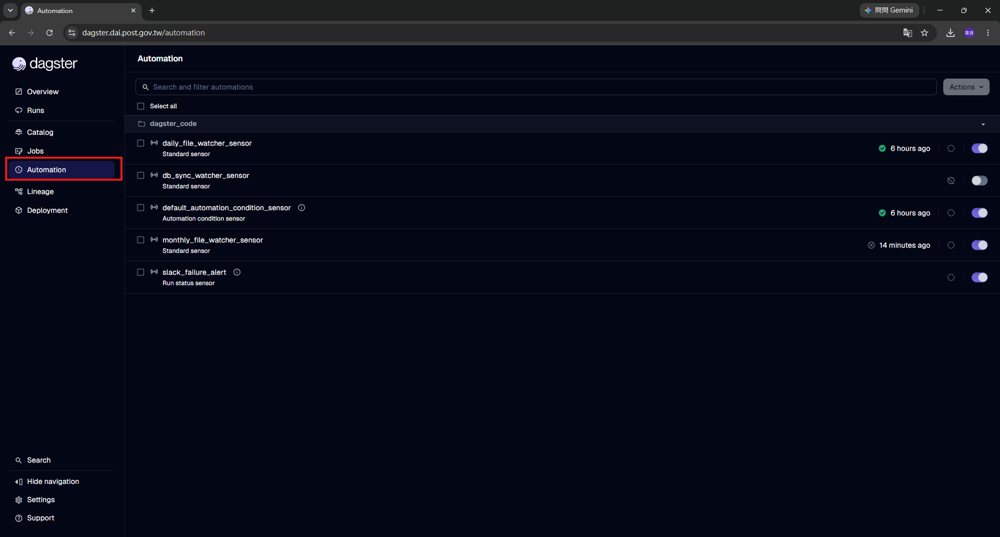
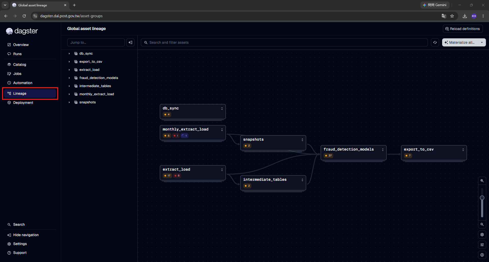
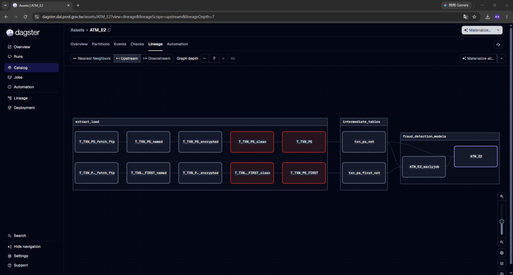
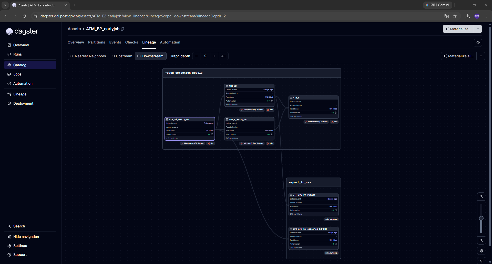

# 01 · 維運人員 每日操作手冊

這份手冊是寫給每天負責看這套系統有沒有正常運作的同仁。

你**不需要**懂 Python、SQL 或 dbt。你要做的事情只有四件:**看狀態 → 判斷是不是真的壞了 → 該重跑的重跑 → 不該自己處理的通報出去**。

系統絕大多數時候會自己跑完,你多半只是確認一下。真的出問題時,這份手冊會告訴你怎麼判斷、怎麼做。

---

## 先認識幾個字

畫面上會一直出現這幾個詞,先有印象就好:

| 畫面上的字 | 白話意思 |
|---|---|
| **Asset(資產)** | 一個處理步驟。像是「下載檔案」「加密」「灌進資料庫」,各自都是一個資產 |
| **Run(執行)** | 一次實際的執行紀錄,點進去可以看過程 |
| **Materialize(實體化)** | 就是「執行這個步驟」 |
| **Partition(分區)** | 資料的日期。`2026-08-01` 就是 8 月 1 日那一批 |
| **Tick** | 偵測器每次「醒來看一下有沒有新檔案」的動作 |

**步驟名稱在不同畫面寫法不一樣**,習慣一下就好:

- 在 **Runs** 的執行畫面裡是 `database__T_CUST`(**兩個底線**)
- 在 **Catalog** 的清單裡是 `database / T_CUST`(**斜線**)

兩個是同一個東西。

---

## 每天要看的三件事

### 步驟 1 · 先看有沒有失敗的執行

左邊選單點 **Runs**。



上方有一排分頁:**All / Backfills / Queued / In progress / Failed**。

> 💡 **最快的做法:直接點 `Failed` 分頁。** 沒有東西就代表今天沒事,整個檢查 10 秒鐘結束。

如果要看全貌就留在 `All`,看 **Status** 那一欄的顏色:

| 狀態 | 意思 | 你要做什麼 |
|---|---|---|
| 🟢 `Success` | 跑完了,沒問題 | 不用理它 |
| 🔵 `Started` | 正在跑 | 不用理它。但**超過 2 小時**還在跑,請通報 |
| ⚪ `Queued` | 排隊中 | 正常。系統同時最多跑 5 個,其他排隊 |
| 🔴 `Failure` | **失敗了** | **往下看步驟 2** |
| ⚫ `Canceled` | 被取消 | 通常是有人手動取消,確認是不是自己人做的 |

這一頁還有兩個欄位很好用:

- **Launched by**:誰啟動的。會顯示 `daily_file_watcher_sensor`、`monthly_file_watcher_sensor`、`default_automation_condition_sensor` 等等,一眼就知道是哪條線
- **Target**:這次跑了什麼。會顯示 `partition: 2026-08-01` 加上資產名稱

**狀態底下如果有 `Re-execution` 的小標籤**,代表這一筆是重跑產生的,不是原始的那一次。

---

### 步驟 2 · 失敗了,看是哪一個步驟失敗

點那一筆的 **View** 進到執行詳細畫面。



上半部是**時間軸**,每一條橫棒是一個步驟,長度代表跑多久:

- 🟩 綠色 = 成功
- 🟧 橘色 / 🟥 紅色 = 失敗

以截圖為例,可以看到 `file_system__T_CUST_named` → `file_system__T_CUST_encrypt...` → `file_system__T_CUST_clean` 都是綠的,後面 `databas...` 那幾條變成橘紅色——問題出在**灌進資料庫**這一步。

#### ★ 重要:你看到的紅色,是系統已經重試三次之後的結果

看畫面**右邊的 `Re-executions` 面板**——截圖裡是 `Re-executions (16)`,底下列出一次次的重試紀錄。

log 裡也會明明白白寫著:

```
Exceeded max_retries of 3
```

意思是**系統自己已經試了三次都失敗**,才把這個 Run 標成紅色送到你面前。

這代表一件很重要的事:**那種「網路抖一下」的暫時性問題,系統早就自己處理掉了,根本不會走到你這裡。** 所以看到紅色時,**先別反射性地再點一次重跑**——先看 log 是什麼原因(步驟 3),再決定重跑有沒有意義。

#### 記下要通報的三樣東西

從這一頁可以拿到:

1. **失敗的步驟名稱**——時間軸上紅色那條,例如 `database__T_CUST`
2. **分區日期**——最上面那排的 `partition: 2026-08-01`
3. **Run ID**——標題旁邊那串,例如 `ee18f327`(或直接複製網址)

| 名稱樣式 | 代表哪個階段 |
|---|---|
| `file_system__XXX_fetch_ftp` | 從 FTP 下載檔案 |
| `file_system__XXX_named` | 套用欄位名稱 |
| `file_system__XXX_encrypted` | 加密 |
| `file_system__XXX_clean` | 資料清洗 |
| `database__XXX` | 灌進資料庫 |
| `file_system__XXX_archive_cleanup` | 封存清理 |
| `XXX`(前面沒有 `file_system__` / `database__`) | dbt 產出名單 |
| `export__XXX` | 匯出 CSV |

---

### 步驟 3 · 看 log,判斷是什麼問題



畫面下半部有三個分頁:**Events / stdout / stderr**。

| 分頁 | 內容 | 什麼時候看 |
|---|---|---|
| **Events** | Dagster 的事件流(哪一步開始、結束、失敗、錯誤訊息) | **主要看這個** |
| **stdout** | 系統寫到標準輸出的內容 | 大多是空的 |
| **stderr** | 系統寫到錯誤輸出的內容 | 有內容時看一下 |

#### ⚠️ 為了資安,UI 上的訊息是精簡過的

系統會把**檔案路徑、遠端指令、遠端輸出、資料筆數**這類明細寫到另一個地方
(有權限管控的 log 系統),**不會顯示在 UI 上**。

所以你看到的錯誤會是這種形式:

```
❌ 入庫階段執行失敗，詳見明細 log 與 BCP 錯誤檔
遠端腳本 bcp_remote.py 有錯誤輸出，詳見明細 log
```

**看到「詳見明細 log」,就是你在 UI 上能查到的極限。** 請照下面的表判斷該不該重跑;
需要更細的內容就通報開發人員,他們有權限去查。

**這不是系統壞掉,是刻意設計的。**

#### ⚠️ 這裡有個一定會卡住的地方

**你必須先「點選」時間軸上的某一個步驟,stdout / stderr 才會有東西。**

沒點的話,那兩個分頁是空的,很多人第一次用會以為壞掉了。

點下去之後,你會看到:

- 時間軸下方的搜尋框自動變成 `name:"database__T_CUST"`
- **分頁旁邊出現一個方框,寫著你正在看的步驟名稱**——確認這裡是不是你要查的那一步

**要查哪個步驟的訊息,就點哪個步驟。要查失敗原因,就點那個紅色的。**

右邊還有 **Download** 按鈕可以把整份 log 下載下來(訊息很長、要傳給別人時很方便)。
畫面最下方那一行灰色小字是這份 log 在伺服器上的實際路徑。

#### 對照這張表判斷

| 訊息裡看到 | 意思 | 你可以做 | 要通報嗎 |
|---|---|---|---|
| `檔案未抵達` / `FileNotFoundError` | 對方的檔案還沒送到 | **等就好**,下一輪會自己補 | 隔天還是沒有 → 通報 |
| `SSH 遠端執行失敗` | VM1 連不上,或上面的程式出錯 | 可以重跑一次 | 重跑還是失敗 → 通報 |
| `BCP 匯入失敗` / `BCP copy in failed` | 資料格式跟資料表對不上 | **不要重跑** | **直接通報** |
| `無法插入 NULL 值到資料行 'XXX'` | 來源資料缺了必填欄位 | **不要重跑** | **直接通報**,附上欄位名稱 |
| `Timeout` / `逾時` | 檔案太大或網路太慢 | 可以重跑一次 | 連續三次 → 通報 |
| `找不到 XXX 的清洗邏輯` | 設定漏掉了 | **不要重跑** | **直接通報** |
| `詳見明細 log` | 細節在有權限管控的 log 裡 | 依這張表判斷要不要重跑 | 需要細節 → 通報 |
| 其他看不懂的 | — | **先不要自己試** | 截圖 + 複製文字通報 |

> **實際例子**(就是截圖裡那一筆):
> ```
> SQLState = 23000, NativeError = 515
> Error = ...無法插入 NULL 值到資料行 'TABLE_DATE'，資料表 'DDEQDTAI.dbo.T_CUST'
> BCP copy in failed
> ```
> 這是「來源資料的 TABLE_DATE 是空的」,屬於**資料問題**,重跑一百次都一樣。直接通報。

#### 判斷的大原則

**重跑只對「暫時性問題」有用**——網路不通、檔案還沒到、逾時這一類。

如果是「資料格式不對」或「設定漏了」,**重跑一百次也是同樣結果**,請直接通報,不要浪費時間。

再提醒一次:系統已經自動重試過三次。你手動再跑一次,只有在「你相信這幾分鐘內狀況已經改變」(例如對方的檔案剛剛才傳完)時才有意義。

---

### 步驟 4 · 需要重跑的時候

右上角有一個 **Re-execute** 按鈕,旁邊有下拉箭頭。點箭頭會展開選單:



選單裡有六個選項,你會用到的是中間那兩個(截圖裡框起來的):

| 選項 | 意思 | 用不用 |
|---|---|---|
| `All steps in root run` | 從第一步全部重跑 | ❌ **不要用**,資料會重複 |
| `Same steps` | 跑一模一樣的步驟 | 幾乎用不到 |
| `Selected step` | **只**跑你選的那一步,不跑後面 | 少用 |
| **`From selected`** | **從你選的那一步,往下跑到底** | ✅ 常用 |
| **`From failure`** | **從失敗的地方接著跑** | ✅ **最常用** |
| `From asset failure` | 從失敗的資產接著跑 | 開發人員才用 |

#### ✅ 一般情況:選 `From failure`

它會從失敗的那一步接著往下跑,前面已經成功的步驟不會重做。既省時間,也不會把已經灌進資料庫的資料再灌一次。

#### ✅ 開發人員請你「從某一步重跑」:選 `From selected`

用法是:**先在時間軸上點選你要開始的那個步驟**,再點 Re-execute → `From selected`。

你會發現按鈕上的文字會跟著變,例如 `Re-execute (name:"file_system__T_CUST_clean")`——**這就是它即將要動的範圍,送出前請先確認這個名稱是對的。**

> 什麼時候用?例如開發人員說「檔案我在 VM1 上修好了,從清洗那步再跑一次就好」。
> **不確定要從哪一步開始就先問**,選錯步驟可能會跳過必要的處理。

#### ❌ 絕對不要選 `All steps in root run`

它會從第一步重頭跑,包含已經成功灌進資料庫的那一步——**資料會重複**。

---

### 步驟 5 · 確認偵測器還活著

系統靠幾支**偵測器(Sensor)**自動發現新檔案並開始處理。**如果偵測器停了,檔案到了也不會有人理它,而且畫面上不會有任何紅色**——這是最容易被忽略的狀況,所以每天要看一眼。

左邊選單 → **Automation**。



清單會顯示每一支的名稱、類型,右邊是**最後狀態 + 時間**,最右邊是**開關**。

| 偵測器 | 類型 | 它在做什麼 |
|---|---|---|
| `daily_file_watcher_sensor` | Standard sensor | 找每日的新檔案 |
| `monthly_file_watcher_sensor` | Standard sensor | 找每月的新檔案 |
| `db_sync_watcher_sensor` | Standard sensor | 看對方資料庫的資料到齊了沒 |
| `default_automation_condition_sensor` | Automation condition sensor | 上游好了就自動帶起下游 |
| `slack_failure_alert` | Run status sensor | 失敗時寫警告訊息 |

你要確認的是:**該開的都開著**(右邊的開關是藍色的)。

> ⚠️ **目前 `db_sync_watcher_sensor` 是關閉狀態。** 如果這是刻意關的就沒問題;
> 如果你發現本來該開的變成關的,請通報——**沒有人會因為它關掉而收到告警**。

**想確認它真的有在動**,點進去看 **Recent ticks**(下一節)。清單上的時間欄位有時候顯示的是「最後一次真的送出工作」而不是「最後一次醒來」,不能只看那個數字就判斷。

#### 為什麼白天感覺很久才動一次

這是刻意設計的:

| 時段(台灣時間) | 實際掃描間隔 |
|---|---|
| **00:00 – 05:59**(檔案密集進來的離峰時段) | **30 秒** |
| **06:00 – 23:59**(一般時段) | **5 分鐘** |

一般時段偵測器其實每 30 秒還是會醒來,但它會檢查「距離上次真的掃描有沒有滿 5 分鐘」,沒滿就直接跳過,tick 紀錄上會寫:

```
一般時段，距上次執行僅 87 秒，略過。
```

**這是正常的,不是壞掉。**

---

## 想知道一個步驟會影響到誰(血緣圖)

有時候你會想知道:「這個步驟失敗了,會不會影響後面的名單?」

Dagster 的**血緣圖(Lineage)**可以看到誰在等誰。

### 看全系統的大圖

左邊選單直接點 **Lineage**:



這是整套系統的鳥瞰圖,每個方塊是一個群組,方塊裡的數字是狀態統計:

```
extract_load ─┐
              ├→ intermediate_tables → fraud_detection_models → export_to_csv
db_sync ──────┘        ↑
monthly_extract_load ──┴→ snapshots
```

**方塊裡出現紅色數字,代表那個群組裡有失敗的資產。**

### 看單一步驟的上下游

左邊選單 **Catalog** → 搜尋名稱 → 點進去 → 選上方的 **Lineage** 分頁。

進去之後,工具列可以切換方向:

- **Upstream(上游)**:這個步驟要等誰跑完

  

  截圖是 `ATM_E2` 的上游,可以一路看到最源頭的 `T_TXN_PS_fetch_ftp`。
  **紅框的方塊就是失敗的**——一眼就知道是哪一段卡住。

- **Downstream(下游)**:誰在等這個步驟

  

  截圖是 `ATM_E2_earlyjob` 的下游,可以看到它會影響 `ATM_E2`、`ATM_F`,
  最後連到 `export_to_csv` 群組裡的兩個匯出。

**通報時如果能一併說「這個失敗會擋住下游的 OO 匯出」,對開發人員幫助很大。**

更完整的操作在 [02_開發人員_UI操作手冊 · 血緣圖](./02_開發人員_UI操作手冊.md#5-血緣圖lineage看一個步驟的上下游)。

---

## 什麼情況要立刻通報

| 狀況 | 嚴重度 |
|---|---|
| 同一張表連續 3 次以上失敗 | 🔴 高 |
| 本來開著的偵測器變成關閉 | 🔴 高 |
| 整個網頁打不開,或 Code locations 顯示紅色 | 🔴 高 |
| Run 卡在 `Started` 超過 2 小時 | 🟠 中 |
| BCP 相關的錯誤 | 🟠 中 |
| 單次失敗,重跑之後就好了 | 🟢 低(記錄一下就好) |

**通報時請一併附上這四樣**,可以省下很多來回:

1. **Run 的網址**(直接複製瀏覽器網址列最快)
2. **失敗的步驟名稱**(例如 `database__T_CUST`)
3. **分區日期**(例如 `2026-08-01`)
4. **UI 上的錯誤訊息**——**請複製文字**,不要只截圖,開發人員要拿它去明細 log 裡比對

---

## 有幾件事請不要做

| 不要做 | 為什麼 |
|---|---|
| 關閉任何偵測器 | 關掉之後檔案到了也不會處理,而且**不會有任何紅色提醒** |
| 選 `All steps in root run` 重跑 | 資料會重複灌進資料庫 |
| 在 Launchpad 手動改參數送出 | 參數打錯會產生錯誤的資料 |
| 點 Reload / Reload definitions | 那是開發人員改完程式才需要做的 |
| 在 Catalog 用 `Wipe materializations` | 會清掉執行紀錄,之後查不到問題怎麼發生的 |

**只要有一點猶豫,先截圖問開發人員。** 問一句話的成本,遠比資料出錯低得多。
