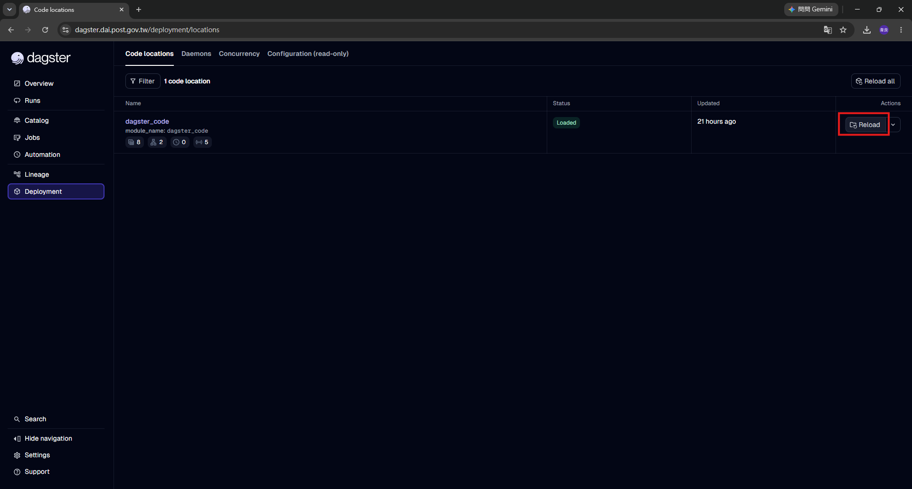
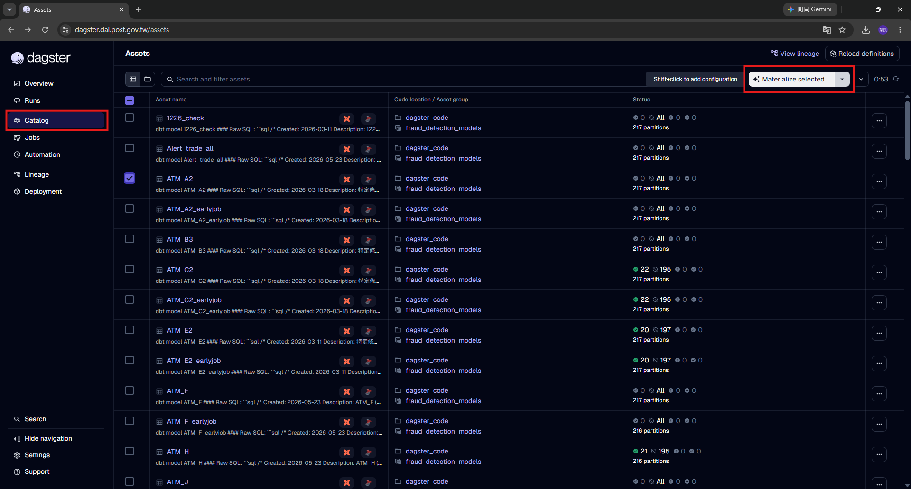
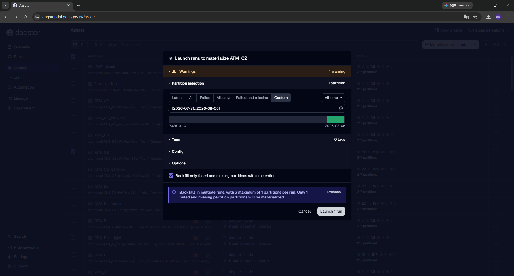
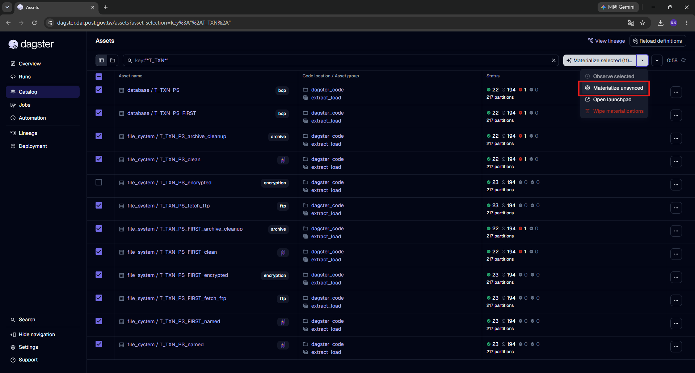
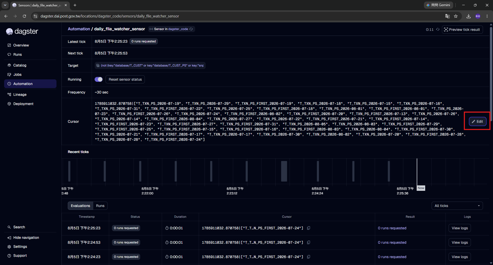

# 02 · 開發人員 UI 操作手冊

這份是寫給會改設定檔、改 SQL、改 Python 的同仁。

裡面的操作**大多會影響資料**,所以維運人員不需要看這篇——他們照 [01 篇](./01_維運人員_每日操作手冊.md) 做就好。

---

## 1. Reload code location

**什麼時候要做**:改了 `dagster_code/` 底下任何 `.py`,或改了設定檔之後。

### 方式 A · Deployment 頁面(完整版)

左邊選單 → **Deployment** → **Code locations** 分頁。



這一頁只有一個 code location:`dagster_code`。欄位是 **Name / Status / Updated / Actions**。

- **Status** 正常是綠色的 `Loaded`
- **Updated** 是上次載入的時間,可以確認你的 Reload 有沒有真的執行
- **Actions** 的 **Reload** 按鈕就是重新載入(右上角的 `Reload all` 效果一樣,這裡只有一個 location)

名稱底下那排小圖示是這個 location 目前註冊的數量(asset group、job、schedule、sensor),Reload 後可以順便確認數字有沒有跟你預期的一致。

這一頁還有另外三個分頁:**Daemons**(daemon 有沒有活著)、**Concurrency**(併發池的使用狀況)、**Configuration (read-only)**(目前生效的 `dagster.yaml`)。

### 方式 B · Catalog 頁面(比較快)

**Catalog** 頁面右上角也有 **Reload definitions** 按鈕,效果一樣。改完設定檔想馬上看資產有沒有出現時,用這個少切一個頁面。

### Reload 之後一定要確認狀態是綠色

紅色的話點進去會看到完整的 Python traceback。這是刻意的設計——語法錯誤、設定值不合法、必填欄位漏掉,全部在這一刻爆出來,而不是等到半夜排程才出事。

| 錯誤訊息關鍵字 | 原因 |
|---|---|
| `IndentationError` | 手改程式時縮排跑掉(Tab 混到空白) |
| `設定值不合法` | 表名 / 索引名 / 分區函式名不符合白名單格式 |
| `必須提供 archive_dir` | 開了 FTP 下載但沒給封存目錄 |
| `No such file or directory: .../manifest.json` | 新增 dbt 模型後沒重新產生 manifest |
| `AttributeError: ... has no attribute` | 用到這個 dagster 版本沒有的 API |

---

## 2. 手動執行單一資產

左邊選單點 **Catalog**。



### 搜尋

搜尋框支援查詢語法,不只是關鍵字比對:

| 打法 | 效果 |
|---|---|
| `T_TXN` | 一般模糊比對 |
| `key:"*T_TXN*"` | 用 asset key 比對,萬用字元 `*` |
| `group:"extract_load"` | 只看某個群組 |

用 `key:"*T_TXN*"` 這種寫法可以一次把某張表的所有節點(fetch_ftp / named / encrypted / clean / database / archive_cleanup)全部撈出來,做整條鏈的操作很方便。

### 清單上看得到什麼

| 欄位 | 內容 |
|---|---|
| **Asset name** | `database / T_TXN_PS` 這種格式,右邊有 compute kind 標籤(`bcp`、`ftp`、`encryption`、`archive`…) |
| **Code location / Asset group** | 例如 `dagster_code` / `extract_load` |
| **Status** | 分區的統計:✅ 已完成 / 🚫 未執行 / ❗ 失敗,以及總分區數 |

### 執行

勾選左邊的核取方塊(可複選),右上角的按鈕會變成 **Materialize selected (N)…**,點它就會跳出執行設定。

> 💡 按鈕旁邊那句 `Shift+click to add configuration` 是說按住 Shift 點可以直接開 Launchpad 改設定,一般不需要。

### 分區怎麼選



跳出來的視窗標題是 `Launch runs to materialize XXX`,重點在 **Partition selection** 這一區:

**上面一排是快捷鍵**,大部分情況直接點就好:

| 按鈕 | 選出什麼 |
|---|---|
| `Latest` | 只有最新那一格 |
| `All` | 全部分區 |
| `Failed` | 只選失敗過的 |
| `Missing` | 只選從來沒跑過的 |
| **`Failed and missing`** | **失敗的 + 沒跑過的**(補資料最常用) |
| `Custom` | 自己指定範圍 |

右邊還有一個時間範圍下拉(`All time`)可以先縮小候選範圍。

**選 `Custom` 的話,有兩種指定方式**:

- **手動輸入**:直接在框裡打 `[2026-07-31...2026-08-05]`,範圍大的時候比拉的準
- **用拉的**:下面那條分區列可以直接拖曳,兩端會顯示起訖日期

### ★ Options:只跑還沒跑的

視窗下方 **Options** 區有一個勾選項:

> ☑ **Backfill only failed and missing partitions within selection**

**勾起來的話,就只會跑你選的範圍內「失敗過的」跟「從來沒跑過的」**,已經成功的不會重做。

勾完下面會出現一段藍色提示,告訴你實際會送出幾個 run,例如:

```
Backfills in multiple runs, with a maximum of 1 partitions per run.
Only 1 failed and missing partition partitions will be materialized.
```

旁邊的 **Preview** 可以先看它到底要跑哪幾格。**送出前看一眼這段話,可以避免不小心丟出幾百個 run。**

確認沒問題再點 **Launch N run**。

### ⚠️ 這個版本沒有「連上游一起跑」的選項

有些 Dagster 版本可以在這裡勾「順便把上游也跑一遍」,**我們這個版本沒有**。

所以上游還沒跑的話,你要**自己先去把上游跑完**。不確定上游是誰,用血緣圖看(第 5 節)。

> 💡 第一次驗證新的表或模型時,**一個節點一個節點跑**,不要一次跑整條鏈。這樣出問題才知道是哪一段。

---

## 3. 補跑一段期間(Backfill)

### ★ 重點:用 Materialize 旁邊的下拉箭頭



**Materialize selected (N)… 按鈕旁邊有一個下拉箭頭**(截圖框起來的地方),點開有四個選項:

| 選項 | 作用 |
|---|---|
| `Observe selected` | 只觀測不執行(我們沒有用 observable source,通常是灰的) |
| **`Materialize unsynced`** | **只跑「還沒同步」的分區**——上游更新了但這個資產還沒跟上的那些 |
| `Open launchpad` | 開 Launchpad 手動改設定後執行 |
| `Wipe materializations` | ⚠️ **清除執行紀錄**,不要隨便點 |

**大範圍補跑時養成用 `Materialize unsynced` 的習慣。** 直接點 Materialize 是把你選到的全部丟出去;用 unsynced 只處理真正需要處理的。

### 執行數量會被兩層限制擋住

就算一次送出很多分區,實際同時在跑的不會失控:

- **同時最多 5 個 Run**(`dagster.yaml` 的 `max_concurrent_runs`)
- **同一個資產不會並行**(每個資產有自己的 pool,上限 1)

所以 backfill 實際上是**一天一天排隊跑**的。送出一個月的量,它會慢慢消化,不會把 VM1 打爆。想看目前的佔用狀況,到 **Deployment → Concurrency**。

### 送出之前先想一下

- dbt 模型是一個分區一個 Run(`max_partitions_per_run=1`),分區數就是 Run 數
- **BCP 是 append**,重跑同一天可能造成資料重複——優先用 `Failed and missing` 或 `Materialize unsynced`,不要無腦 `All`
- 進行中的 backfill 可以在 **Runs → Backfills** 分頁追蹤

---

## 4. Sensor 的 cursor:讓它重新處理,或立刻掃一次

左邊選單 → **Automation** → 點進該 sensor。



這一頁的欄位:

| 欄位 | 內容 |
|---|---|
| **Latest tick** | 最後一次醒來的時間,以及結果(例如 `0 runs requested`) |
| **Next tick** | 下一次預計醒來的時間 |
| **Target** | 這支 sensor 管哪些資產(一長串 selection 條件) |
| **Running** | 開關 + `Reset sensor status` 按鈕 |
| **Frequency** | 醒來的頻率,檔案 watcher 是 `~30 sec` |
| **Cursor** | 它記住的狀態,右邊有 **Edit** 按鈕 |

下方 **Recent ticks** 是每次醒來的長條圖,再下面 **Evaluations / Runs** 表格列出每次 tick 的
Timestamp / Status / Duration / **Cursor** / Result / **View logs**。

從截圖可以看到 tick 是 `2:24:23` → `2:24:53` → `2:25:23`,**剛好每 30 秒一次**,而 Status 都是 `0 runs requested`——這就是一般時段的節流:醒來了但沒真的掃。

### cursor 的結構

```
1785911032.870758|["T_TXN_PS_2026-07-19", "T_TXN_PS_FIRST_2026-07-19", ...]
```

| 段落 | 作用 |
|---|---|
| `1785911032.870758` | 上次**真的執行掃描**的時間戳,用來做時段節流 |
| `[...]` | 已經派過工的「表名_日期」清單,用來去重 |

### 兩層節流機制

| 時段(台灣時間) | 實際掃描間隔 |
|---|---|
| **00:00 – 05:59** | **30 秒**(每次 tick 都真的掃) |
| **06:00 – 23:59** | **5 分鐘**(tick 照常,但沒滿 300 秒就跳過) |

一般時段的 tick log 會寫 `一般時段，距上次執行僅 87 秒，略過。`——正常現象。

### 💡 想立刻掃一次,不想等那 5 分鐘

節流是拿 cursor 前面那個時間戳算出來的。所以點 **Edit**,**把時間戳刪掉,只留 `|` 和後面的清單**:

```
原本 →  1785911032.870758|["T_TXN_PS_2026-07-19", ...]
改成 →  |["T_TXN_PS_2026-07-19", ...]
```

時間戳被當成 0,「距上次執行」變成一個很大的數字,節流條件不成立,**下一個 tick(30 秒內)就會真的去掃**。

**而且後面的已處理清單有保留,所以不會把舊檔案重跑一遍。** 這是改完設定想立刻驗證時最方便的做法。

### 想讓它重新處理已經做過的檔案

那就要動後面那段清單,一樣用 **Edit**:

- **只想重跑某幾個**:把清單裡對應的 `"表名_日期"` 項目刪掉
- **全部重來**:把整個 cursor 清空(或用 `Reset sensor status` 旁邊的相關功能)

> ⚠️ **清空整個 cursor 之前先確認目錄裡有幾個檔案。** 清空之後所有還留在監控目錄裡的檔案都會被重新派工,可能一次觸發一大批 Run。
>
> 只想重跑某一天的話,**用 Catalog 手動 Materialize 比較安全**,不要動 cursor。

> `Reset sensor status` 是重設「執行狀態」(開關那一列),跟 cursor 是兩件事,不要搞混。

### 看 sensor 為什麼沒抓到檔案

在 Evaluations 表格點該筆的 **View logs**。正常會看到每張表的掃描結果:

```
[T_TXN_PS] 監控目錄: /data/fromFPP/T_TXN_PS (mode=ftp), 找到: ['T_TXN_PS_20260801012819.zip']
```

| log 裡看到 | 代表 |
|---|---|
| 完全沒有這張表的訊息 | 這張表的 `freq` 跟這支 sensor 不符,或設了 `manual_only` |
| `找到: []` | 目錄裡沒有符合副檔名的檔案(zip 的表只看 `.zip`,其他看 `.csv`) |
| `檔案 xxx 似乎還在寫入中` | 檔案修改時間距現在不到 60 秒,下一輪會再試 |
| `一般時段，距上次執行僅 N 秒，略過` | 正常節流 |
| `❌ [xxx] FTP 列目錄失敗` | VM1 連 FTP 有問題 |

> 右上角的 **Preview tick result** 可以在不真的送出 run 的情況下試跑一次,改完 sensor 邏輯時很好用。

---

## 5. 血緣圖(Lineage):看一個步驟的上下游

### 全域血緣圖:左邊選單的 Lineage


左邊選單直接點 **Lineage**,會看到 `Global asset lineage`——**以群組為單位**的鳥瞰圖:

```
extract_load ─┐
              ├→ intermediate_tables → fraud_detection_models → export_to_csv
db_sync ──────┘        ↑
monthly_extract_load ──┴→ snapshots
```

每個方塊裡的數字是狀態統計(綠 = 正常、紅 = 失敗)。左邊的 `Jump to...` 可以展開群組直接跳到某個資產。

**這張圖最適合拿來對新人解釋整套系統怎麼串起來的。**

### 單一資產的血緣圖

**Catalog** → 搜尋 → 點進資產,上方會有一排分頁:

**Overview | Partitions | Events | Checks | Lineage | Automation**

選 **Lineage**。工具列有三個方向按鈕跟一個深度控制:

| 控制項 | 作用 |
|---|---|
| `Nearest Neighbors` | 只看直接相鄰的上下游 |
| `⇤ Upstream` | 只往上游展開 |
| `Downstream ⇥` | 只往下游展開 |
| `Graph depth` `−` `N` `+` `All` | 展開幾層。追到源頭就按 `All` |

#### Upstream:這個資產在等誰


截圖是 `ATM_E2` 往上游展開 7 層,可以清楚看到整條鏈:

```
extract_load 群組
  T_TXN_PS_fetch_ftp → _named → _encrypted → _clean → T_TXN_PS
                                                        ↓
intermediate_tables 群組:txn_ps_net / txn_ps_first_net
                                                        ↓
fraud_detection_models 群組:ATM_E2_earlyjob → ATM_E2
```

**紅框的方塊就是失敗的資產**——截圖裡 `T_TXN_PS_clean`、`T_TXN_PS`、`T_TXN_PS_FIRST` 都是紅的,一眼就知道下游沒資料是因為上游的清洗跟入庫失敗了。

#### Downstream:誰在等這個資產


截圖是 `ATM_E2_earlyjob` 往下游展開 2 層。方塊上會顯示 **Latest event**(多久以前跑的)、
**Partitions**(填了幾 %)、**Automation**、總分區數,右下角還有 compute kind 標籤
(`Microsoft SQL Server`、`dbt`、`ssh_pymssql`)。

可以看到它會影響 `ATM_E2` → `ATM_F`,最後連到 `export_to_csv` 群組的
`mrt_ATM_E2_EXPORT` 與 `mrt_ATM_E2_earlyjob_EXPORT` 兩個匯出。

**要停用或改一張表之前,先用這個確認會影響到誰。**

### 什麼時候特別好用

| 情境 | 怎麼用 |
|---|---|
| 某個 dbt 模型沒資料 | Upstream + `All`,看哪一格是紅的 |
| 要手動跑一個資產,但不知道上游跑完沒 | Upstream,看上游方塊的 Partitions 填充率 |
| 某張表要停用 / 改結構 | Downstream,先確認會影響誰 |
| 新增了模型,想確認相依有沒有接對 | 看 `ref()` / `source()` 有沒有正確變成圖上的連線 |

> 💡 相依關係完全靠 dbt 的 `ref()` 跟 `source()` 建立。**圖上少一條線,通常代表 SQL 裡把表名寫死了**,而不是圖畫錯。

> 網址會帶參數(`?view=lineage&lineageScope=upstream&lineageDepth=7`),
> 可以直接把整個視角複製給別人。

---

## 5-B · 查明細 log(路徑、指令、遠端輸出)

**UI 上看不到明細了。** 為配合資安要求,檔案路徑、遠端指令、遠端 stdout/stderr、
筆數這些都寫到獨立的明細 log,由 rsyslog 收走。UI 上只會看到:

```
❌ 入庫階段執行失敗，詳見明細 log 與 BCP 錯誤檔
遠端腳本 bcp_remote.py 有錯誤輸出，詳見明細 log
```

### 明細在哪裡

| 情況 | 位置 |
|---|---|
| 已接 rsyslog(設了 `DAGSTER_DETAIL_SYSLOG`) | rsyslog 主機 |
| 預設 | 容器內 `/app/workspace/dagster_home/logs/pipeline_detail.log` |

```bash
# 用 Run ID 撈出這一次執行的全部明細
grep "run=ee18f327" /app/workspace/dagster_home/logs/pipeline_detail.log

# 只看某個資產
grep "asset=file_system/T_TXN_PS_clean" /app/workspace/dagster_home/logs/pipeline_detail.log
```

每一則都帶 `run=` / `asset=` / `partition=`,可以直接跟 UI 上的 Run 對起來。

> 完整說明與調整方式見 [18_Log分流與資安](../進階調整/18_Log分流與資安.md)。

---

## 6. 查編譯後的 SQL

dbt 模型寫的是樣板語法,實際執行的 SQL 在 `target/`。

**方法 A · 直接在 VM4 上看**
```bash
cat /data/deploy/workspace/dagster_workspace/dbt_project/target/compiled/post_office_dbt/models/ATM_C2.sql
```

**方法 B · 不等排程,自己編譯指定日期**
```bash
docker run --rm \
  -v /data/deploy/workspace/dagster_workspace/dbt_project:/app/workspace/dbt_project \
  -w /app/workspace/dbt_project \
  --network docker-compose_vm4-network \
  dai/dagster:v2.6 \
  dbt compile --select ATM_C2 --vars '{"target_date": "2026-08-01"}' --profiles-dir .
```

**方法 C · 在 Run log 裡看**
dbt 執行時固定帶 `--debug`,log 裡會印出實際 SQL。**記得要先點選那個 dbt 步驟**,stdout / stderr 才會載入。

---

## 7. 重新產生 manifest

**什麼時候要做**:新增 / 改名 / 刪除 dbt 模型或快照之後。
**這一步漏掉的話,Dagster 完全看不到你的新模型。**

```bash
docker run --rm \
  -v /data/deploy/workspace/dagster_workspace/dbt_project:/app/workspace/dbt_project \
  -w /app/workspace/dbt_project \
  --network docker-compose_vm4-network \
  dai/dagster:v2.6 \
  dbt parse --profiles-dir .
```

跑完再回 UI 做 **Reload definitions**。

---

## 8. 兩個批次 Job

左邊選單 → **Jobs**。

| Job | 內容 |
|---|---|
| `__DAILY_ASSET_JOB` | 所有日檔資產(排除月檔與 `manual_only` 的表) |
| `__MONTHLY_ASSET_JOB` | 所有月檔資產(排除 `manual_only` 的表) |

這兩個 job **沒有排程**,只給人工整批補跑用。日常運作靠 sensor。

---

## 9. 改完程式後的標準驗證流程

```
1. 語法檢查（在容器裡）
   python3 -m py_compile /app/workspace/dagster_code/*.py

2. 如果動到 dbt → 重新產生 manifest（第 7 節）

3. Reload definitions → 確認 Code locations 是綠色 Loaded
   （順便看 Updated 時間有沒有更新）

4. Catalog 頁面 → 用 key:"*表名*" 搜尋，確認新資產出現，
   群組與分區數正確

5. 用 Lineage 分頁確認上下游接對了（第 5 節）

6. 手動 Materialize 單一分區 → 一個節點一個節點看 log
   （記得要點選步驟，stdout / stderr 才會載入）

7. 確認實際結果：
   - 檔案線 → VM1 上的檔案、資料庫筆數、bcp_error_logs
   - dbt   → target/compiled 的 SQL、資料庫表內容
   - 匯出   → 輸出的 CSV 內容與編碼

8. 看 sensor 的 View logs 有沒有掃到
   （想立刻看到結果就把 cursor 前面的時間戳清掉，見第 4 節）

9. 觀察一個完整週期（隔天早上再確認一次）
```

---

## 10. 危險操作對照

| 操作 | 風險 | 做之前 |
|---|---|---|
| `Wipe materializations` | 清掉執行紀錄,無法復原 | 幾乎沒有正當理由要用 |
| 清空 sensor cursor | 可能一次觸發大量 Run | 先確認目錄裡有幾個檔案;只想立刻掃就改成清時間戳 |
| `All steps in root run` 重跑 | 資料重複灌入 | 幾乎都該改用 `From failure` 或 `From selected` |
| 大範圍直接 Materialize | 佔滿執行佇列數小時 | 改用 `Materialize unsynced`,或勾「只跑失敗與缺漏」,送出前看 Preview |
| 改 `dagster.yaml` | 要重啟容器,期間全部停擺 | 挑離峰時段 |
| 改 `partition_function` 相關設定 | 動到資料庫的實體分區結構 | 先在測試環境驗證 |
