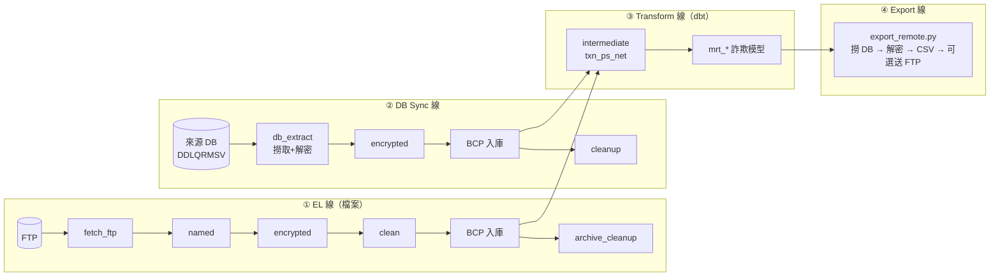

# Dagster Workspace 架構與維運手冊

> 適用範圍：`dagster_workspace/` 底下所有內容（Dagster code location + dbt 專案）。
> 目的：讓接手的人可以（1）看懂資料怎麼流、（2）知道每個檔案放什麼、（3）照 SOP 新增一張表或一支 SQL、（4）查到每個設定值的意義與預設值。

---

## 目錄

1. [系統總覽](#1-系統總覽)
2. [目錄結構：哪個位置放什麼](#2-目錄結構哪個位置放什麼)
3. [`target/` 與 `compiled/`：去哪裡看「帶入變數後的 SQL」](#3-target-與-compiled去哪裡看帶入變數後的-sql)
4. [Asset 命名規則與資料流](#4-asset-命名規則與資料流)
5. [排程與觸發機制（Sensor / Automation / Job）](#5-排程與觸發機制sensor--automation--job)
6. [SOP A：新增一張來源表（檔案落地 → BCP 入庫）](#6-sop-a新增一張來源表檔案落地--bcp-入庫)
7. [SOP B：新增一支 dbt model（SQL）](#7-sop-b新增一支-dbt-modelsql)
8. [SOP C：新增 intermediate model 與 snapshot](#8-sop-c新增-intermediate-model-與-snapshot)
9. [SOP D：新增一個 CSV 匯出](#9-sop-d新增一個-csv-匯出)
10. [SOP E：新增一張 DB 直連同步表](#10-sop-e新增一張-db-直連同步表)
11. [設定值完整字典](#11-設定值完整字典)
12. [部署、Reload 與驗證](#12-部署reload-與驗證)
13. [疑難排解與已知注意事項](#13-疑難排解與已知注意事項)

---

## 1. 系統總覽

### 1.1 主機角色

| 角色 | 位置 | 負責什麼 |
|---|---|---|
| **VM4（Dagster 主機）** | 跑 `dagster-webserver` / `dagster-daemon` / code server 的容器 | 排程、相依性判斷、發指令、收 log。**不碰原始資料檔內容**（唯一例外：透過 `pymssql` 對 SQL Server 下 partition/index 的 DDL） |
| **VM1（Runner 主機）** | `10.10.159.74`，帳號 `bcp_runner` | 真正做事的機器：連 FTP、解壓縮、套檔規、加解密、清洗、BCP、匯出 CSV。所有腳本放在 `/home/bcp_runner/scripts/` |
| **dbt 執行容器** | 由 Dagster 用 `PipesDockerClient` 動態啟動，image `dai/dagster:v2.6` | 執行 `dbt build` / `dbt snapshot`，掛載 `dbt_project` 目錄 |
| **SQL Server** | `10.10.20.92:1433`，DB `DDEQDTAI`，schema `dbo` | 資料倉儲本體 |

VM4 → VM1 一律走 **SSH + Dagster Pipes**（`dagster_code/pipes_ssh_client.py`），指令用 `shlex.quote()` 逐一跳脫；VM1 的腳本用 `dagster_pipes` 把 log / metadata 從 stdout 回吐給 Dagster UI。

### 1.2 四條資料線



| 線 | 資料來源 | 由誰驅動 | 程式進入點 |
|---|---|---|---|
| ① EL 線 | FTP 或本地落地目錄的 CSV/ZIP | `daily_file_watcher_sensor` / `monthly_file_watcher_sensor` | `dagster_code/assets.py::build_table_assets` |
| ② DB Sync 線 | 對方的 SQL Server（`DDLQRMSV`） | `db_sync_watcher_sensor`（輪詢筆數穩定） | `dagster_code/db_sync/assets.py` |
| ③ Transform 線 | 我方 DB 的 `dbo.T_*` | 上游 asset 完成後由 `AutomationCondition.eager()` 自動帶起 | `dagster_code/assets.py::post_office_dbt_assets` |
| ④ Export 線 | 我方 DB 的 `mrt_*` | dbt model 完成後由 automation condition 自動帶起 | `dagster_code/assets.py::build_export_assets` |

### 1.3 目前規模

- EL 表：15 張（`TABLE_CSV_MAPPING`）
- DB Sync 表：1 張（`DB_SYNC_MAPPING`）
- dbt model：37 支（`models/`）+ 2 支中介表（`models/intermediate/`）
- dbt snapshot：2 支（`snapshots/`）
- CSV 匯出：7 個（`SQL_TO_CSV_MAPPING`）

---

## 2. 目錄結構：哪個位置放什麼

> 容器內路徑固定是 `/app/workspace/`，對應 VM4 host 的 `/data/deploy/workspace/dagster_workspace/`。
> 也就是 **本 repo 的 `dagster_workspace/` = 容器的 `/app/workspace/`**。程式碼裡看到 `/app/workspace/xxx` 就是這裡的 `xxx`。

```
dagster_workspace/                    ← 容器 /app/workspace
│
├── workspace.yml                     ← Dagster code location 定義（載入哪個 python module）
│
├── dagster_home/
│   └── dagster.yaml                  ← Dagster 實例層設定（併發、log、auto-materialize）
│                                        對應環境變數 DAGSTER_HOME
│
├── dagster_code/                     ← Dagster 的 Python 程式（= code location 模組）
│   ├── __init__.py                   ← 【總入口】Definitions：註冊 assets / jobs / sensors / resources
│   ├── assets.py                     ← 【核心】EL asset 工廠、dbt asset、Export asset、白名單驗證函式
│   ├── table_mapping.py              ← 【設定檔】TABLE_CSV_MAPPING（來源表）、SQL_TO_CSV_MAPPING（匯出）
│   ├── sensors.py                    ← 檔案到站偵測 sensor、automation sensor、失敗告警 sensor
│   ├── selections.py                 ← 依 manifest + config 動態組出「月檔 asset 集合」
│   ├── pipes_ssh_client.py           ← 自製 Pipes Client：SSH 到 VM1 執行腳本
│   ├── .env                          ← ★未進版控★ DB_SERVER / DB_NAME / DB_USER / DB_PASS
│   └── db_sync/                      ← DB 直連同步線（跟 EL 線平行的另一套）
│       ├── config.py                 ← DB_SYNC_MAPPING 與穩定判定秒數
│       ├── assets.py                 ← db_extract / encrypted / bcp / cleanup 四個節點的工廠
│       └── sensors.py                ← 輪詢來源 DB 筆數是否穩定的 sensor
│
└── dbt_project/                      ← dbt 專案（容器 /app/workspace/dbt_project）
    ├── dbt_project.yml               ← 專案名稱、路徑設定、group、flags
    ├── profiles.yml                  ← 連線資訊（type/server/database/user/password）
    ├── models/
    │   ├── sources.yml               ← ★所有 dbt 可以 source() 的來源表都要在這裡登記★
    │   ├── _groups.yml               ← group 與 owner 定義
    │   ├── intermediate/             ← 中介層（去沖正、淨額表），被其他 model 用 ref() 引用
    │   │   ├── txn_ps_net.sql        →  實體表 T_TXN_PS_NET
    │   │   └── txn_ps_first_net.sql  →  實體表 T_TXN_PS_FIRST_NET
    │   └── *.sql                     ← 產出層：37 支詐欺偵測 model，多數 alias 成 mrt_*
    ├── snapshots/
    │   ├── snp_cust.sql              ← T_CUST 的緩慢變動維度快照
    │   └── snp_dim_cust_act.sql
    ├── macros/                       ← ★repo 內目前不存在，但實機一定有★（見 §13.1）
    │                                    提供 get_config()，17 支 model 依賴它
    ├── target/                       ← ★編譯產出★ 不進版控，執行後才生成（見 §3）
    ├── logs/                         ← dbt 自己的 dbt.log
    └── dbt_packages/                 ← dbt deps 下載的套件（目前無 packages.yml）
```

### 2.1 每支 Python 檔在做什麼（細節）

| 檔案 | 內容 | 什麼時候要改它 |
|---|---|---|
| `__init__.py` | 建 `Definitions`：`assets=[EL 資產, Export 資產, dbt daily, dbt monthly, db_sync 資產]`、`jobs=[__DAILY_ASSET_JOB, __MONTHLY_ASSET_JOB]`、`sensors=[5 支]`、`resources={"pipes": PipesDockerClient, "ssh_pipes": PipesSSHClient}` | 新增「一整條新的線」或新 sensor / resource 時 |
| `assets.py` | ①`validate_sql_identifier` / `validate_path_component` 白名單防注入 ②`build_table_assets()` 依 config 動態產生 1～6 個 asset ③`CustomDbtTranslator` 決定 dbt asset 的 partition、automation condition、partition mapping ④`get_topological_levels()` + `_run_dbt_levels()` 把 dbt model 分層執行 ⑤`build_export_assets()` | 要改「節點流程本身」時（例如新增一個處理階段） |
| `table_mapping.py` | 純設定字典。檔頭有一份完整註解版 `TEMPLATE_TABLE` 範本可直接複製 | **新增/調整一張來源表或一個匯出時，九成只改這裡** |
| `sensors.py` | `_ssh_run` / `_ssh_listdir` / `_ssh_run_ftp_listdir` 遠端查檔；cursor 編解碼；`_watch_files_and_build_requests()` 共用掃描邏輯；daily / monthly 兩支 sensor；`automation_sensor`；`slack_failure_alert` | 改偵測頻率、穩定秒數、單次派發上限時 |
| `selections.py` | 讀 `manifest.json` 找出 `monthly_job` tag 或 snapshot，聯集 `TABLE_CSV_MAPPING` 裡 `freq=="monthly"` 的表，組成 monthly selection | 幾乎不用改 |
| `pipes_ssh_client.py` | `PipesSSHClient`：組 env → `shlex.quote` 全跳脫 → `ssh` 執行 → 收 stdout → 解析 Pipes 訊息。SSH 目標與金鑰路徑是模組層常數 | 換 VM1 IP / 帳號 / 金鑰 / timeout 時 |

### 2.2 VM1 上的腳本（不在本 repo，但流程強相依）

放在 VM1 的 `/home/bcp_runner/scripts/`：

| 腳本 | 被誰呼叫 | 做什麼 |
|---|---|---|
| `list_ftp_remote.py` | sensor | 列 FTP 目錄，回傳 JSON `[{name, mtime, size}]` |
| `fetch_ftp_remote.py` | `*_fetch_ftp` | 下載（可多檔合併 / 目錄前綴比對 / 解密 zip） |
| `assign_columns_remote.py` | `*_named` | 依檔規把無表頭的固定寬度檔切欄位、補欄位名 |
| `encrypt_remote.py` | `*_encrypted` | 對指定欄位加密 |
| `clean_remote.py` | `*_clean` | 各表專屬清洗邏輯（**新表若開 `has_clean_func` 要在這裡補對應分支**） |
| `bcp_remote.py` | `database/*` | 執行 BCP 匯入，錯誤寫 error log |
| `archive_cleanup_remote.py` | `*_archive_cleanup` / `*_cleanup` | 刪明碼暫存、把加密檔（可重新壓密碼 zip）搬進 archive |
| `export_remote.py` | `export/*` | 連我方 DB 撈資料、解密、寫 CSV、可選上傳 FTP |
| `check_source_db.py` | db_sync sensor | 查來源 DB 各批次筆數 |
| `extract_source_db.py` | `*_db_extract` | 連來源 DB 撈資料 + `F_DecryptData` 解密後落地 |

VM1 上另有一份 `.env`，放 `ZIP_PWD_<表名大寫>`、`SOURCE_DECRYPT_KEY` 等機密。**密碼本身從不經過 Dagster，Dagster 只傳「環境變數的名字」。**

---

## 3. `target/` 與 `compiled/`：去哪裡看「帶入變數後的 SQL」

這是最常被問到的事：model 裡寫的是 Jinja（`{{ var("target_date") }}`、`{{ ref() }}`、`{{ source() }}`），**實際下給 SQL Server 的是什麼**？答案全在 `dbt_project/target/`。

### 3.1 目錄結構與用途

由 `dbt_project.yml` 的 `target-path: "target"` 決定，路徑相對於 dbt 專案根目錄：

```
dbt_project/target/
├── compiled/post_office_dbt/
│   ├── models/ATM_C2.sql                     ← ★純 SELECT，Jinja 已展開、變數已帶入★
│   ├── models/intermediate/txn_ps_net.sql
│   └── snapshots/snp_cust.sql
├── run/post_office_dbt/
│   ├── models/ATM_C2.sql                     ← ★真正送出去的 DDL/DML★
│   │                                            （含 CREATE TABLE / 增量的 delete+insert 包裝）
│   └── snapshots/snp_cust.sql
├── manifest.json        ← ★Dagster 讀這份來產生 dbt asset 與相依圖★
├── run_results.json     ← 上一次執行每個節點的狀態、耗時、訊息
├── graph.gpickle / graph_summary.json / partial_parse.msgpack  ← dbt 內部快取
└── catalog.json         ← 只有跑過 dbt docs generate 才有
```

**`compiled/` vs `run/` 的差別**

- `compiled/` = 你的 SQL 被 Jinja 渲染後的樣子。`{{ ref('txn_ps_net') }}` 會變成 `"DDEQDTAI"."dbo"."T_TXN_PS_NET"`，`{{ var("target_date") }}` 會變成 `2026-08-01`。**要拿去 SSMS 貼上手動驗證邏輯，複製這一份。**
- `run/` = 在 compiled 外面再包上 materialization 邏輯（建表、暫存表交換、`delete+insert` 等）。**要看「為什麼資料沒進去 / 增量策略怎麼跑」，看這一份。**

### 3.2 實際檔案在哪一台機器上

dbt 是在動態啟動的容器裡跑的，但 `dbt_project` 是用 volume 掛進去的（`assets.py::_run_dbt_levels`），所以產出會直接落在 VM4 的磁碟上：

| 視角 | 路徑 |
|---|---|
| dbt 容器內 | `/app/workspace/dbt_project/target/compiled/post_office_dbt/models/<model>.sql` |
| **VM4 host（直接 SSH 上去看這個）** | `/data/deploy/workspace/dagster_workspace/dbt_project/target/compiled/post_office_dbt/models/<model>.sql` |
| 本 repo | `dagster_workspace/dbt_project/target/`（不進版控，clone 下來是空的） |

查看範例：

```bash
# 在 VM4 上，看 ATM_C2 這次實際跑的 SQL
cat /data/deploy/workspace/dagster_workspace/dbt_project/target/compiled/post_office_dbt/models/ATM_C2.sql

# 看它包成什麼 DML
cat /data/deploy/workspace/dagster_workspace/dbt_project/target/run/post_office_dbt/models/ATM_C2.sql
```

### 3.3 不想等排程，想立刻產生某一天的 compiled SQL

`dbt compile` 只編譯不執行，安全：

```bash
docker run --rm \
  -v /data/deploy/workspace/dagster_workspace/dbt_project:/app/workspace/dbt_project \
  -w /app/workspace/dbt_project \
  --network docker-compose_vm4-network \
  dai/dagster:v2.6 \
  dbt compile --select ATM_C2 --vars '{"target_date": "2026-08-01"}' --profiles-dir .
```

跑完到 §3.2 的路徑撈檔案即可。`--select` 支援 dbt 全部選擇語法（`ATM_C2+`、`tag:daily_job`、`+ATM_C2`）。

### 3.4 重要限制

- **`target/` 每次執行都會被覆寫**，只保留「最後一次」的內容。要留存某一天的 SQL 請自己複製出來。
- **`manifest.json` 不存在，整個 code location 起不來。** `assets.py` 與 `sensors.py` 都在 import 期間讀 `post_office_dbt.manifest_path`。新增/改名 model 之後一定要重新產生 manifest（`dbt parse` 或 `dbt compile`），Dagster 才看得到新 asset。
- Dagster UI 那邊也看得到：Run → 該 dbt asset 的 log 裡，`--debug` 會把實際 SQL 印出來（`_run_dbt_levels` 固定帶 `--debug`）。

---

## 4. Asset 命名規則與資料流

### 4.1 Asset key 規則

Asset key 是 Dagster 的唯一識別，UI 上顯示成 `prefix/name`：

| 線 | Asset key | Group | 由誰產生 |
|---|---|---|---|
| EL | `file_system/<表名>_fetch_ftp` | `extract_load` / `monthly_extract_load` | `use_ftp_fetch=True` 才建 |
| EL | `file_system/<表名>_named` | 同上 | `use_data_rule=True` 才建 |
| EL | `file_system/<表名>_encrypted` | 同上 | `encrypt_fields` 非空才建 |
| EL | `file_system/<表名>_clean` | 同上 | `has_clean_func=True` 才建 |
| EL | `database/<表名>` | 同上 | **一定會建**（BCP 節點） |
| EL | `file_system/<表名>_archive_cleanup` | 同上 | `use_ftp_fetch=True` 才建 |
| DB Sync | `file_system/<表名>_db_extract`、`file_system/<表名>_encrypted`、`database/<表名>`、`file_system/<表名>_cleanup` | `db_sync` | 四個節點固定都建 |
| dbt | `<model 檔名（不含 .sql）>` | `fraud_detection_models` / `intermediate_tables` / `snapshots` | 讀 manifest 自動產生 |
| Export | `export/<SQL_TO_CSV_MAPPING 的 key>` | `export_to_csv` | 固定一個節點 |

**關鍵觀念**：dbt 的 asset key 用的是 **model 檔名**，不是 `alias`。`alias='mrt_ATM_C2'` 只影響 DB 裡的實體表名。所以：

- `ref('ATM_C2')` → 用檔名
- `SQL_TO_CSV_MAPPING` 的 `depends_on_dbt_model` → 用檔名
- `source('database', 'mrt_ATM_C2')` → 用 **DB 實體表名（alias）**

### 4.2 EL 線節點鏈（會自動跳過沒開的節點）

```
fetch_ftp → named → encrypted → clean → database/<表> → archive_cleanup
   ↑           ↑         ↑         ↑
use_ftp_fetch  use_data_rule  encrypt_fields  has_clean_func
```

每個節點的 `deps` 是「往前找第一個有開的節點」，所以中間關掉任何一個都不會斷鏈。

檔名在各階段的變化（以 `template = "T_TXN_PS_{date}.csv"`、partition `2026-08-01` 為例）：

| 階段 | 路徑 |
|---|---|
| FTP 原始檔 | `<ftp_remote_dir>/T_TXN_PS_20260801*.zip` |
| 下載落地（有加密欄位時走 staging） | `~/<staging_subfolder>/T_TXN_PS_20260801.csv` |
| 套檔規後 | `~/<staging_subfolder>/T_TXN_PS_20260801_NAMED.csv` |
| 加密後（固定寫回 `input_folder`） | `<input_folder>/T_TXN_PS_20260801_ENCRYPTED.csv` |
| 清洗後 | `<output_folder>/T_TXN_PS_20260801_CLEAN.csv` |
| BCP 讀取 | 上面「最後一個有開的階段」的產物 |
| BCP error log | `<output_folder>/bcp_error_logs/T_TXN_PS_error_20260801.log` |
| 封存 | `<archive_dir>/`（只留一個 zip，其餘中繼檔刪除） |

`freq="monthly"` 時日期格式是 `YYYYMM`（取前 6 碼），partition key 固定是該月 1 號。

### 4.3 BCP 節點額外做的四件事

`database/<表名>` 這個 asset 不只是 BCP，順序是：

1. **Partition 維護**（`use_partition=True`）：確認下個月的 partition 存在，不存在就 `ALTER PARTITION SCHEME NEXT USED` + `SPLIT RANGE`。
2. **舊資料淘汰**（`retention_years` + `archive_table` 都有給）：把 `retention_years` 年前那個月的 partition `SWITCH` 到 archive 表 → `TRUNCATE` → `MERGE RANGE`。
3. **Disable index**（`use_index=True`）→ **BCP**（SSH 到 VM1）→ **Rebuild index**（`FILLFACTOR = 100`）。
4. 上述 DDL 是 Dagster 容器用 `pymssql` 直連 DB 執行（帳密來自 `dagster_code/.env`），SQL 用 `GO` 切批次依序送。

> 表名、index 名、partition function 名、archive 表名都**無法用 bind parameter**，所以在 `build_table_assets()` 一開始就用 `validate_sql_identifier()` 白名單擋（只允許英數字底線、不可數字開頭）。設定值不合法會在 code location 載入時就炸掉，不會等到執行期。

---

## 5. 排程與觸發機制（Sensor / Automation / Job）

### 5.1 五支 Sensor

| Sensor | 間隔 | 監控什麼 | 觸發什麼 |
|---|---|---|---|
| `daily_file_watcher_sensor` | 最短 30s | `freq=="daily"` 的表：FTP 目錄（`use_ftp_fetch`）或本地目錄 | 該表整條 EL 鏈的 asset selection |
| `monthly_file_watcher_sensor` | 最短 30s | `freq=="monthly"` 的表 | 同上 |
| `db_sync_watcher_sensor` | 最短 300s | 來源 DB 各批次 row count | db_sync 四個節點 |
| `automation_sensor` | 由 `dagster.yaml` 的 `auto_materialize.minimum_interval_seconds: 30` 控制 | 全部 asset 的 `AutomationCondition` | dbt model、Export（上游好了就自己跑） |
| `slack_failure_alert` | 事件驅動 | run 徹底失敗 | 寫 error log（目前只 log，未真的送 Slack） |

### 5.2 檔案 watcher 的判斷邏輯（daily / monthly 共用 `_watch_files_and_build_requests`）

1. **時段節流**：台灣時間 00:00–06:00 是離峰，每 tick（30s）都掃；其他時段距上次執行未滿 300s 直接 skip。
2. **副檔名**：`use_ftp_zip=True` 的表看 `.zip`，其他看 `.csv`。
3. **寫入穩定**：`now - mtime < 60s`（`FILE_STABLE_SECONDS`）視為還在寫入，跳過。
4. **日期解析**：daily 抓檔名裡的 `\d{8}` → `YYYY-MM-DD`；monthly 抓 `\d{6}` → `YYYY-MM-01`。
5. **去重**：`run_key = "<表名>_<partition>"` 存進 cursor，處理過就不再送。
6. **單次上限**：一個 tick 最多派 3 個 run（`max_files`）。**達到上限時故意不推進時間戳**，讓下一個 tick（30s 後）能立刻接著處理，不會被 300s 節流擋住。
7. Cursor 格式：`"<last_run_ts>|<processed_keys 的 JSON list>"`。**要重跑已處理過的檔案，就到 UI 的 Sensor 頁面 Reset cursor。**

### 5.3 db_sync sensor 的「筆數穩定」判斷

FTP 線看 mtime，DB 線沒有 mtime，所以改看 row count：同一批次（`sensor_watch_col` 前 8/6 碼分組）的筆數連續 `DB_SYNC_STABLE_SECONDS`（300s）不變才視為到齊；超過 `DB_SYNC_STALL_WARN_SECONDS`（7200s）還在變就發 warning。

### 5.4 Automation Condition

dbt model 與 Export asset 都用：

```python
AutomationCondition.eager().without(AutomationCondition.in_latest_time_window())
```

意思是：**上游 partition 一好就急切地跑，而且不限定只跑最新時間窗**（所以補跑舊 partition 時，下游也會跟著自動補）。

### 5.5 Partition 定義

| 名稱 | 定義 | 用在 |
|---|---|---|
| `daily_partitions` | `DailyPartitionsDefinition(start_date="2026-01-01", end_offset=1)` | `freq="daily"` 的 EL/db_sync 表、`tag:daily_job` 的 dbt model、daily 匯出 |
| `monthly_partitions` | `MonthlyPartitionsDefinition(start_date="2026-01-01", end_offset=1)` | `freq="monthly"` 的表、`tag:monthly_job` 的節點、snapshot |

`end_offset=1` 代表「包含未來一格」，這樣今天就能跑今天的 partition。

**特例 partition mapping**（`CustomDbtTranslator.get_partition_mapping`）：`ATM_C2 ← ATM_C2_earlyjob` 與 `ATM_E2 ← ATM_E2_earlyjob` 是「今天的 model 吃昨天的上游」，用 `TimeWindowPartitionMapping(start_offset=-1, end_offset=-1, allow_nonexistent_upstream_partitions=True)`。要再加類似關係，改這個函式。

### 5.6 Job

| Job | 內容 | 用途 |
|---|---|---|
| `__DAILY_ASSET_JOB` | `AssetSelection.all() - monthly_selection` | UI 手動整批重跑日檔 |
| `__MONTHLY_ASSET_JOB` | `monthly_selection` | UI 手動整批重跑月檔 |

`monthly_selection` = manifest 裡有 `monthly_job` tag 或 resource_type 為 snapshot 的節點 ∪ `monthly_extract_load` group。日常運作靠 sensor，不靠 job；job 主要給人工補跑用。

### 5.7 併發控制

- `dagster.yaml`：`QueuedRunCoordinator.max_concurrent_runs: 5`、`default_op_concurrency_limit: 1`。
- 每個 asset 都帶 `pool=<asset 名>`，配合上面的 limit=1，**同一個 asset 不會同時跑兩份**（避免同一張表被兩個 partition 同時 BCP）。
- 重試有兩層：asset 層 `RetryPolicy(max_retries=retries, delay=retry_delay_sec)`；run 層 tag `dagster/max_retries: 3` + `dagster/retry_strategy: FROM_ASSET_FAILURE`（只重跑失敗的 asset）。dbt 那層另有 `_run_dbt_levels` 內建的「每層最多重試 2 次、間隔 30s」。

---

## 6. SOP A：新增一張來源表（檔案落地 → BCP 入庫）

以下用 `T_NEW_TABLE` 為例。**九成的工作只在 `table_mapping.py`。**

### Step 1｜先在 SQL Server 把東西建好（Dagster 不會幫你建表）

- [ ] 建目標表 `dbo.T_NEW_TABLE`（欄位、型別、`TABLE_DATE` 之類的分區欄位）
- [ ] 若要用 `bcp_target`：建對應的 View（例如 `v_BCP_T_NEW_TABLE`，通常用來對齊 BCP 欄位順序 / 排除自增欄）
- [ ] 若 `use_index=True`：建好 index，名稱記下來
- [ ] 若 `use_partition=True`：建好 partition function / scheme / filegroup，以及 `archive_table`（結構要跟本表一致才能 `SWITCH`）

### Step 2｜在 `dagster_code/table_mapping.py` 新增設定

複製檔頭的 `TEMPLATE_TABLE` 註解區塊，貼到 `TABLE_CSV_MAPPING` 裡改名。最小可動設定（本地落地、無加密、無清洗）：

```python
"T_NEW_TABLE": {
    "input_folder": "/run/media/root/D/data/fromFPP/T_NEW_TABLE",
    "output_folder": "/run/media/root/D/data/T_NEW_TABLE/T_NEW_TABLE_CLEANED",
    "template": "T_NEW_TABLE_{date}.csv",
    "freq": "daily",
    "delimiter": "|",
    "retries": 3,
    "retry_delay_sec": 60,
},
```

FTP + zip + 檔規 + 加密 + 分區的完整版（照 `T_TXN_PS` 抄）：

```python
"T_NEW_TABLE": {
    # 0. FTP
    "use_ftp_fetch": True,
    "ftp_remote_dir": "/data/fromFPP/T_NEW_TABLE/",
    "ftp_remote_filename_prefix": "T_NEW_TABLE_{date}",
    "use_ftp_zip": True,
    "zip_inner_filename": "EXNP_XXXX",       # zip 內檔名跟外層不同時才給
    "staging_subfolder": "T_NEW_TABLE",
    "archive_dir": "/run/media/root/D/data/archive/T_NEW_TABLE",
    # 1. 路徑與基礎
    "input_folder": "/run/media/root/D/data/fromFPP/T_NEW_TABLE",
    "output_folder": "/run/media/root/D/data/T_NEW_TABLE/T_NEW_TABLE_CLEANED",
    "template": "T_NEW_TABLE_{date}.csv",
    "freq": "daily",
    "delimiter": "|",
    "use_data_rule": True,
    # 2. 處理邏輯
    "has_clean_func": True,
    # 3. 容錯
    "retries": 3,
    "retry_delay_sec": 60,
    # 4. BCP
    "bcp_target": "v_BCP_T_NEW_TABLE",
    # 5. Index
    "use_index": True,
    "index_name": "IX_T_NEW_TABLE",
    # 6. Partition
    "use_partition": True,
    "partition_function": "pf_NEW_Monthly",
    "retention_years": 2,
    "archive_table": "T_NEW_TABLE_Archive",
    # 7. 加密
    "encrypt_fields": ["ACT_NO", "ID"],
},
```

**互斥規則（違反會在載入時直接報錯）**

- `use_ftp_fetch=True` → 必填 `archive_dir`，且 **`ftp_remote_template`** 或 **`ftp_remote_dir` + `ftp_remote_filename_prefix`** 二擇一，不能同時給。
- `ftp_remote_dir` 與 `ftp_remote_filename_prefix` 必須成對出現。
- `use_ftp_fetch=False` → 必填 `input_folder`。
- 表名 / `bcp_target` / `index_name` / `partition_function` / `archive_table` 必須符合 `^[A-Za-z_][A-Za-z0-9_]{0,127}$`。
- `staging_subfolder` 必須符合 `^[A-Za-z0-9_-]{1,128}$`（不可含 `/`、`..`）。

### Step 3｜VM1 上要配合的事

- [ ] `has_clean_func=True` → 到 `/home/bcp_runner/scripts/clean_remote.py` 補 `--table T_NEW_TABLE` 對應的清洗分支
- [ ] `use_data_rule=True` → 檔規（欄位定義）要有 `T_NEW_TABLE` 這個 sheet；若 sheet 名跟表名不同，用 `"data_rule_sheet": "實際sheet名"` 指定
- [ ] `use_ftp_zip=True` → VM1 `.env` 新增 `ZIP_PWD_T_NEW_TABLE=<密碼>`（變數名固定是 `ZIP_PWD_` + 表名大寫）
- [ ] 建立所有會用到的目錄：`input_folder`、`output_folder`、`output_folder/bcp_error_logs`、`archive_dir`、`~/<staging_subfolder>`

### Step 4｜讓 dbt 能引用（要在 dbt 用到才需要）

在 `dbt_project/models/sources.yml` 的 `database` source 底下加一行：

```yaml
      - name: T_NEW_TABLE
```

之後在 model 裡用 `{{ source('database', 'T_NEW_TABLE') }}`。

### Step 5｜生效與驗證

1. Dagster UI → **Deployment → Code locations → Reload**（或重啟 code server）。
2. Asset 頁面確認出現 `file_system/T_NEW_TABLE_*` 與 `database/T_NEW_TABLE`，group 是 `extract_load` 或 `monthly_extract_load`。
3. **先手動 materialize 單一 partition**（選一天，一個節點一個節點跑），確認 VM1 路徑、檔規、BCP 都對。
4. 再看 sensor：Sensors 頁面 → 對應 watcher → Tick log 應該看得到 `[T_NEW_TABLE] 監控目錄: ...`。
5. 檢查 `output_folder/bcp_error_logs/` 沒有非預期的錯誤列。

---

## 7. SOP B：新增一支 dbt model（SQL）

以下用 `NEW_MODEL` 為例，產出 DB 實體表 `mrt_NEW_MODEL`。

### Step 1｜建檔 `dbt_project/models/NEW_MODEL.sql`

**檔名就是 asset key，也是 `ref()` / `depends_on_dbt_model` 要用的名字，取名後不要隨便改。**

沿用現有慣例的骨架：

```sql
/*
Created: 2026-08-04
Description: 這支 model 在做什麼（一句話講清楚業務目的）
Change Log:
- 2026-08-04 [NEW] 初版
*/

-- dbt config
{{ config(
    materialized='incremental',
    alias='mrt_NEW_MODEL',
    tags=["NEW_MODEL", "daily_job"]
) }}

-- ======================================================================
-- 日期變數設定 (由 Dagster 以 --vars 帶入 partition date)
-- ======================================================================


WITH T_BASE AS (
    SELECT
        ACT_NO
        , TXN_AMT
    FROM {{ ref('txn_ps_net') }}          -- 引用其他 model 用 ref()
    WHERE TABLE_DATE = '{{ target_date }}'
)

, T_JOINED AS (
    SELECT
        b.ACT_NO
        , b.TXN_AMT
        , c.STATUS_PBA_CODE
    FROM T_BASE b
    LEFT JOIN {{ source('database', 'T_CUST_WARNINGFLG') }} c   -- 引用來源表用 source()
        ON b.ACT_NO = c.ACT_NO
       AND c.TABLE_DATE = '{{ target_date }}'
)

SELECT
    ACT_NO
    , TXN_AMT
    , STATUS_PBA_CODE
    , '{{ target_date }}' AS TABLE_DATE      -- ★一定要輸出 TABLE_DATE，下游與匯出都靠它★
FROM T_JOINED
```

**必守規則**

| 規則 | 原因 |
|---|---|
| `tags` 一定要含 `daily_job` 或 `monthly_job` | `post_office_dbt_assets` 用 `select="tag:daily_job"`、monthly 用 `select="tag:monthly_job"`。**沒 tag 的 model 不會被任何 Dagster asset 涵蓋，等於永遠不會跑。** |
| 日期一律用 `var("target_date")` | Dagster 把 partition key 用 `--vars '{"target_date": "..."}'` 傳進來 |
| 輸出要有 `TABLE_DATE` 欄位 | 下游 model 與 Export 都用它篩當日資料 |
| 引用其他 model 用 `ref('檔名')`，引用來源表用 `source('database', '實體表名')` | 相依圖完全靠這兩個函式建立；寫死表名 = Dagster 看不到相依關係，執行順序會亂 |
| `alias` 給 DB 實體表名（慣例 `mrt_` 開頭） | 不給的話實體表名 = 檔名 |
| 第二個 tag 建議放業務代號（`"ATM C2"`、`"RISK_IP"`） | 方便 `dbt build --select tag:xxx` 手動挑 |

`materialized` 目前全專案都用 `incremental`。若要用增量策略要一併給 `unique_key`（例：`intermediate/txn_ps_net.sql` 用 `unique_key='Seq_ID'` + `incremental_strategy='delete+insert'`）；沒給策略時 dbt-sqlserver 走預設 append，重跑同一天會重複，**所以重跑前記得先刪當日資料，或改用 `delete+insert`**。

### Step 2｜若引用了新的來源表

到 `models/sources.yml` 的 `database` source 底下登記（同 SOP A Step 4）。**沒登記就 `source()` 會直接編譯失敗。**

### Step 3｜重新產生 manifest（★最容易漏掉的一步★）

Dagster 是讀 `target/manifest.json` 來生 asset 的，manifest 沒更新 = 新 model 在 UI 上不存在。

```bash
docker run --rm \
  -v /data/deploy/workspace/dagster_workspace/dbt_project:/app/workspace/dbt_project \
  -w /app/workspace/dbt_project \
  --network docker-compose_vm4-network \
  dai/dagster:v2.6 \
  dbt parse --profiles-dir .
```

（`dbt compile` 也會順便更新 manifest，還能同時檢查 SQL 語法。）

### Step 4｜Reload code location

Dagster UI → Deployment → Code locations → Reload。新 asset 會出現在 `fraud_detection_models` group。

### Step 5｜驗證

1. 看 `target/compiled/post_office_dbt/models/NEW_MODEL.sql`，確認變數與 `ref`/`source` 都展開成預期的表名。
2. 把 compiled SQL 貼進 SSMS 手跑，確認筆數合理。
3. Dagster UI 手動 materialize 一個 partition，看 log 裡的 `[拓撲分層]` 有沒有把它排到正確的層。
4. 確認 DB 裡 `dbo.mrt_NEW_MODEL` 有資料，且 `TABLE_DATE` 正確。

### Step 6｜（可選）要匯出成 CSV → 走 SOP D

---

## 8. SOP C：新增 intermediate model 與 snapshot

### 8.1 Intermediate model

放在 `models/intermediate/`，其餘同 SOP B。差別只有：

- `dbt_project.yml` 已設定 `intermediate` 目錄自動歸到 `+group: intermediate_tables`
- 慣例上 `alias` 不加 `mrt_` 前綴（例：`T_TXN_PS_NET`），代表它是中介資料不是產出名單
- 通常會設 `unique_key` + `incremental_strategy='delete+insert'`，因為會被重跑

### 8.2 Snapshot

放在 `snapshots/`，語法不同（`` 區塊）：

```sql


{{
    config(
      target_schema='snapshots',
      unique_key='SOME_PK',
      strategy='check',
      updated_at='TABLE_DATE',
      check_cols=['COL_A', 'COL_B'],
      invalidate_hard_deletes=True,
      tags=["snapshot", "monthly_job"]     -- ★monthly_job 必加★
    )
}}



SELECT *
FROM {{ source('database', 'T_XXX') }}
WHERE 1=1

    AND TABLE_DATE = '{{ target_date }}'

    AND TABLE_DATE = (SELECT MAX(TABLE_DATE) FROM {{ source('database', 'T_XXX') }})



```

Snapshot 一定是月頻（`CustomDbtTranslator.get_partitions_def` 對 `resource_type == "snapshot"` 直接給 monthly partition），並且由 `post_office_dbt_monthly_assets` 用 **`dbt snapshot`** 指令執行。

> ⚠️ 因為月線固定下 `dbt snapshot`（見 `_run_dbt_levels(..., is_snapshot=True)`），**目前月線只能跑 snapshot，不能跑一般 model**。若哪天要新增「月頻的 model」，必須先改 `assets.py` 讓月線也能下 `dbt build`，否則 model 會被 Dagster 標成成功但實際什麼都沒做。

---

## 9. SOP D：新增一個 CSV 匯出

### Step 1｜在 `table_mapping.py` 的 `SQL_TO_CSV_MAPPING` 加設定

```python
"mrt_NEW_MODEL_EXPORT": {
    # 1. 資料來源（二擇一）
    "source_table": "mrt_NEW_MODEL",     # ← DB 實體表名（alias），不是 model 檔名
    "date_column": "TABLE_DATE",
    # "source_sql": "SELECT ... WHERE d >= '{start_date}' AND d < '{end_date}'",  # 給了就優先用

    # 2. 輸出（VM1 本機路徑）
    "output_folder": "/run/media/root/D/data/PostBS/Project_output/99_new_model/",
    "template": "NEW_MODEL_EXPORT_{date}.csv",
    # "ftp_remote_path": "/data/PostBS/Project_output/99_new_model/",   # 要送回 FTP 才給
    # "one_more_day_flg": True,          # 檔名日期要 +1 天才給
    "freq": "daily",
    "delimiter": ",",
    "encoding": "utf-8-sig",

    # 3. 容錯
    "retries": 3,
    "retry_delay_sec": 60,

    # 4. 等哪支 dbt model 跑完（★用 model 檔名，不是 alias★）
    "depends_on_dbt_model": "NEW_MODEL",
    # 多個上游："depends_on_dbt_model": ["NEW_MODEL", "OTHER_MODEL"],

    # 5. 要還原成明碼的欄位
    "decrypt_fields": ["帳號"],
},
```

### Step 2｜VM1 建好 `output_folder` 目錄

### Step 3｜Reload code location

新 asset 出現在 `export/mrt_NEW_MODEL_EXPORT`，group `export_to_csv`。

### Step 4｜驗證

它的 automation condition 是 eager，所以 `depends_on_dbt_model` 指定的 model 一 materialize 完，30 秒內 automation sensor 就會帶起匯出。先手動 materialize 一次確認檔案內容與編碼（`utf-8-sig` 是給 Excel 開的 BOM）。

**時間區間邏輯**：daily → `[partition_date, partition_date + 1 天)`；monthly → `[該月 1 號, 次月 1 號)`。這個區間是傳給 `export_remote.py` 的 `--start-date` / `--end-date`，`source_sql` 裡可以用 `{start_date}` / `{end_date}` 佔位。

---

## 10. SOP E：新增一張 DB 直連同步表

適用「對方直接給 DB 而不是給檔案」的情境。

### Step 1｜在 `dagster_code/db_sync/config.py` 的 `DB_SYNC_MAPPING` 加設定

```python
"T_NEW_ALERT": {
    "freq": "daily",                                   # daily / monthly
    "source_db": "DDLQRMSV",                           # 來源資料庫名
    "source_table": "dbo.T_NEW_ALERT",                 # 來源表（schema.table）
    "bcp_target": "T_NEW_ALERT",                       # 我方目標表，省略 = 同 key
    "decrypt_fields": ["ACCOUNT", "ID"],               # 來源端密文，用對方的 F_DecryptData 解
    "encrypt_fields": ["ACCOUNT", "ID"],               # 落我方 DB 前改用我們的方式加密
    "decrypt_key_env": "SOURCE_DECRYPT_KEY",           # VM1 .env 裡的金鑰變數名
    "sensor_watch_col": "NOTIFY_DATE",                 # sensor 用來分批次的欄位
    # "notify_date_col": "NOTIFY_DATE",                # extract 的 WHERE 欄位，省略 = 同上
    "retries": 0,
    "retry_delay_sec": 60,
    "archive_dir": "T_NEW_ALERT_archive",              # ★必填★
},
```

### Step 2｜前置條件

- [ ] VM1 對來源 DB 連得通，且權限足以呼叫 `F_DecryptData`
- [ ] VM1 `.env` 有 `decrypt_key_env` 指定的金鑰
- [ ] 我方 DB 已建好 `bcp_target` 表
- [ ] `archive_dir` 目錄存在（相對路徑會接在 `/run/media/root/D/data/` 之後）

### Step 3｜Reload → 驗證

四個 asset 會出現在 `db_sync` group。Sensor 每 5 分鐘輪詢一次，筆數穩定 5 分鐘才會觸發。

> 注意：`db_sync` group 不屬於 `monthly_extract_load`，所以即使設 `freq="monthly"`，`__MONTHLY_ASSET_JOB` 也不會涵蓋它（它會落在 daily job 的選集裡）。人工補跑請直接對 asset 操作。

---

## 11. 設定值完整字典

### 11.1 `TABLE_CSV_MAPPING`（EL 線，`dagster_code/table_mapping.py`）

| 鍵 | 型別 | 預設 | 必填 | 說明 |
|---|---|---|---|---|
| **0. FTP 下載** |
| `use_ftp_fetch` | bool | `False` | 否 | 是否建立 `*_fetch_ftp` 節點自動下載 |
| `ftp_remote_template` | str | 無 | 條件 | 完整遠端路徑模板，`{date}` 會被替換。與下面兩個互斥 |
| `ftp_remote_dir` | str | 無 | 條件 | 遠端目錄。遠端檔名帶 timestamp 時用這個模式 |
| `ftp_remote_filename_prefix` | str | 無 | 條件 | 遠端檔名前綴，`{date}` 會被替換；與 `ftp_remote_dir` 必須成對 |
| `use_ftp_zip` | bool | `False` | 否 | 來源是加密 zip，需下載後解壓；同時 sensor 改監控 `.zip` |
| `zip_inner_filename` | str | `None` | 否 | zip 內要抽出的檔名；不給則取 zip 內第一個檔 |
| `expected_part_count` | int | `1` | 否 | 大於 1 代表遠端拆成多檔，下載後合併成單一檔 |
| `staging_subfolder` | str | 表名 | 否 | VM1 家目錄下的暫存子資料夾（明碼只落在這裡） |
| `archive_dir` | str | 無 | `use_ftp_fetch=True` 時必填 | 封存目錄 |
| **1. 路徑與基礎** |
| `input_folder` | str | FTP 模式下為表名 | 非 FTP 模式必填 | 原始檔讀取目錄；加密後的檔也固定寫回這裡 |
| `output_folder` | str | 同 `input_folder` | 否 | 清洗輸出目錄 |
| `error_log_dir` | str | `<output_folder>/bcp_error_logs` | 否 | BCP 錯誤 log 目錄 |
| `template` | str | 無 | **是** | 本地標準檔名模板，必須含 `{date}` |
| `freq` | `"daily"` \| `"monthly"` | 無 | **是（實務上必填）** | 決定 partition 定義、日期格式、group、由哪支 sensor 監控。⚠️ 不填會出現不一致狀態：partition 變成 monthly（`freq == "daily"` 才給 daily），group 卻是 `extract_load`，而且兩支 sensor 都用 `config.get("freq") != freq` 過濾 → **這張表永遠不會被自動觸發** |
| `delimiter` | str | `","` | 否 | CSV 分隔符 |
| `use_data_rule` | bool | `False` | 否 | 建立 `*_named` 節點，依檔規補欄位名 |
| `data_rule_sheet` | str | 表名 | 否 | 檔規 sheet 名稱與表名不同時指定 |
| **2. 處理邏輯** |
| `has_clean_func` | bool | `False` | 否 | 建立 `*_clean` 節點，呼叫 `clean_remote.py` |
| **3. 容錯** |
| `retries` | int | `0` | 否 | asset 層重試次數；`0` 代表不設 RetryPolicy |
| `retry_delay_sec` | int | `60` | 否 | 重試間隔秒數 |
| **4. BCP** |
| `bcp_target` | str | 表名 | 否 | BCP 目標表或 View |
| **5. Index** |
| `use_index` | bool | `False` | 否 | BCP 前 DISABLE、BCP 後 REBUILD |
| `index_name` | str | `IX_<表名>` | 否 | index 名稱 |
| **6. Partition** |
| `use_partition` | bool | `False` | 否 | 啟用 partition 自動維護 |
| `partition_function` | str | `""` | `use_partition=True` 時必填 | partition function 名稱 |
| `retention_years` | int | `None` | 否 | 保留年限；與 `archive_table` 都給才會執行淘汰 |
| `archive_table` | str | `""` | 否 | `SWITCH PARTITION` 的目標表 |
| **7. 資安** |
| `encrypt_fields` | list[str] | `[]` | 否 | 要加密的欄位；非空才建立 `*_encrypted` 節點 |

### 11.2 `SQL_TO_CSV_MAPPING`（Export 線）

| 鍵 | 型別 | 預設 | 必填 | 說明 |
|---|---|---|---|---|
| `source_table` | str | 無 | 與 `source_sql` 二擇一 | 來源實體表名（alias） |
| `date_column` | str | 無 | 用 `source_table` 時需要 | 日期篩選欄位 |
| `source_sql` | str | 無 | 二擇一 | 整段 SQL，優先於 `source_table`；可用 `{start_date}` / `{end_date}` |
| `output_folder` | str | 無 | 否 | VM1 上的輸出目錄；不給就不落地本機 |
| `template` | str | 無 | **是** | 輸出檔名模板，含 `{date}` |
| `ftp_remote_path` | str | 無 | 否 | 要順便送上 FTP 時給；結尾是 `/` 會自動接檔名 |
| `one_more_day_flg` | bool | `False` | 否 | 檔名日期 +1 天（對方要求檔名用隔日的情境） |
| `freq` | str | `"daily"` | 否 | 決定 partition 與日期格式 |
| `delimiter` | str | `","` | 否 | 分隔符 |
| `encoding` | str | `"utf-8-sig"` | 否 | 輸出編碼 |
| `retries` / `retry_delay_sec` | int | `0` / `60` | 否 | 重試設定 |
| `depends_on_dbt_model` | str \| list[str] | 無 | 否 | 上游 dbt model **檔名**；決定何時自動觸發 |
| `decrypt_fields` | list[str] | `[]` | 否 | 匯出前要還原成明碼的欄位 |

### 11.3 `DB_SYNC_MAPPING`（`dagster_code/db_sync/config.py`）

| 鍵 | 型別 | 預設 | 必填 | 說明 |
|---|---|---|---|---|
| `freq` | `"daily"` \| `"monthly"` | 無 | **是** | partition 與批次分組長度（8 / 6 碼） |
| `source_db` | str | 無 | **是** | 來源資料庫名 |
| `source_table` | str | 無 | **是** | 來源表 `schema.table` |
| `bcp_target` | str | key 名 | 否 | 我方目標表 |
| `decrypt_fields` | list[str] | `[]` | 否 | 來源端要解密的欄位 |
| `encrypt_fields` | list[str] | `[]` | 否 | 入我方 DB 前要加密的欄位 |
| `decrypt_key_env` | str | `"SOURCE_DECRYPT_KEY"` | 否 | VM1 `.env` 裡的金鑰變數名 |
| `sensor_watch_col` | str | `"NOTIFY_DATE"` | 否 | sensor 分批次的欄位 |
| `notify_date_col` | str | 同 `sensor_watch_col` | 否 | extract 時 WHERE 用的欄位 |
| `delimiter` | str | `"\|"` | 否 | 中繼 CSV 分隔符 |
| `retries` / `retry_delay_sec` | int | `0` / `60` | 否 | 重試設定 |
| `archive_dir` | str | 無 | **是** | 封存目錄（相對路徑會接在 `/run/media/root/D/data/` 後） |

模組層常數：`DB_SYNC_STABLE_SECONDS = 300`（筆數要穩定多久）、`DB_SYNC_STALL_WARN_SECONDS = 7200`（超時警告）。

### 11.4 dbt `config()` 常用參數

| 參數 | 本專案慣例 | 說明 |
|---|---|---|
| `materialized` | `'incremental'`（全專案 39 支都是） | 增量表 |
| `alias` | `'mrt_XXX'`（產出層）/ `'T_XXX_NET'`（中介層） | DB 實體表名；不給則等於檔名 |
| `tags` | `["業務代號", "daily_job"]` | **`daily_job` / `monthly_job` 決定被哪個 Dagster asset 涵蓋，缺一不可** |
| `unique_key` | 中介層有給 | 增量比對鍵 |
| `incremental_strategy` | `'delete+insert'`（中介層） | 不給則走 dbt-sqlserver 預設 |
| `target_schema` | snapshot 用 `'snapshots'` | snapshot 專用 |
| `strategy` / `check_cols` / `updated_at` / `invalidate_hard_deletes` | snapshot 用 | 變動偵測方式 |

### 11.5 `dbt_project.yml`

| 設定 | 值 | 說明 |
|---|---|---|
| `name` / `profile` | `post_office_dbt` | **兩者與 `profiles.yml` 最上層 key 必須完全一致**，否則連不上 DB |
| `model-paths` | `["models"]` | model 目錄 |
| `snapshot-paths` | `["snapshots"]` | snapshot 目錄 |
| `macro-paths` | `["macros"]` | macro 目錄（`get_config()` 在這裡） |
| `target-path` | `"target"` | 編譯產出位置（見 §3） |
| `clean-targets` | `["target", "dbt_packages"]` | `dbt clean` 會刪掉的目錄 |
| `models.post_office_dbt.+group` | `fraud_detection_models` | 預設 group |
| `models.post_office_dbt.intermediate.+group` | `intermediate_tables` | 中介層 group |
| `snapshots.post_office_dbt.+group` | `snapshots` | snapshot group |
| `flags.dbt_sqlserver_use_native_string_types` | `true` | 用原生字串型別，避免全部變 nvarchar |
| `flags.dbt_sqlserver_use_default_schema_concat` | `true` | schema 名組合方式（snapshot 的 `snapshots` schema 才不會變成 `dbo_snapshots`） |

### 11.6 `profiles.yml`

| 欄位 | 值 | 說明 |
|---|---|---|
| `target` | `dev` | 目前只有一個 output |
| `type` | `sqlserver` | 需要 `dbt-sqlserver` adapter |
| `driver` | `ODBC Driver 18 for SQL Server` | image 內必須裝好 |
| `server` / `port` / `database` / `schema` | `10.10.20.92` / `1433` / `DDEQDTAI` / `dbo` | 連線目標 |
| `user` / `password` | `{{ env_var('DBT_DB_USER') }}` / `{{ env_var('DBT_DB_PASSWORD') }}` | **不寫明碼**，由環境變數帶入；VM4 上要確保 dbt 容器讀得到這兩個變數（見 §13.4） |
| `encrypt` / `trust_cert` | `true` / `true` | 內網自簽憑證需要 |

執行時另有兩處指定 profile 位置：`docker_pipes` 的 `env={"DBT_PROFILES_DIR": "/app/workspace/dbt_project"}`，以及指令尾巴的 `--profiles-dir .`（working dir 就是 dbt 專案根）。

### 11.7 `dagster_home/dagster.yaml`

| 設定 | 值 | 影響 |
|---|---|---|
| `run_coordinator` | `QueuedRunCoordinator`, `max_concurrent_runs: 5` | 同時最多 5 個 run |
| `concurrency.default_op_concurrency_limit` | `1` | 每個 pool 同時只跑 1 個 op；配合 asset 的 `pool=<asset名>` 達成「同一 asset 不並行」 |
| `telemetry.enabled` | `false` | 關閉官方遙測外連 |
| `python_logs.python_log_level` | `INFO` | UI 才看得到 INFO log |
| `python_logs.managed_python_loggers` | daemon / scheduler / sensor | 這三個 logger 的輸出會進 Dagster event log |
| `auto_materialize.enabled` | `true` | 啟用 automation condition |
| `auto_materialize.minimum_interval_seconds` | `30` | automation sensor 評估頻率 |
| `code_servers.reload_timeout` | `300` | reload code location 的等待上限（本專案載入時要讀 manifest，需要較長時間） |
| `code_servers.local_startup_timeout` | `120` | code server 啟動上限 |

### 11.8 `workspace.yml`

```yaml
load_from:
  - python_module:
      module_name: dagster_code
      working_directory: /app/workspace
```

也就是：容器工作目錄 `/app/workspace`，載入 `dagster_code` 這個 Python module 的 `defs`。改模組名或路徑要一起改這裡。

### 11.9 程式內的硬編碼常數（要改就得改程式）

| 常數 | 位置 | 值 |
|---|---|---|
| `SSH_HOST` / `SSH_USER` / `SSH_KEY_PATH` | `pipes_ssh_client.py` | `10.10.159.74` / `bcp_runner` / `/home/dagster_user/.ssh/dagster_to_vm1` |
| `timeout_seconds` | `pipes_ssh_client.py` | `7200`（單一 SSH 指令上限 2 小時） |
| `DBT_PROJECT_DIR` | `assets.py`、`sensors.py` | `/app/workspace/dbt_project` |
| `CONTAINER_DATA_DIR` | `assets.py` | `/run/media/root/D/data/`（相對路徑的基準） |
| env 檔位置 | `assets.py` | `/app/workspace/dagster_code/.env` |
| dbt image / network / volume | `assets.py::_run_dbt_levels` | `dai/dagster:v2.6` / `docker-compose_vm4-network` / `/data/deploy/workspace/dagster_workspace/dbt_project` |
| `FILE_STABLE_SECONDS` | `sensors.py` | `60` |
| `OFF_PEAK_INTERVAL_SECONDS` / `PEAK_INTERVAL_SECONDS` | `sensors.py` | `30` / `300` |
| 離峰時段 | `sensors.py` | 台灣時間 00:00–06:00 |
| `max_files`（單 tick 派發上限） | `sensors.py` | `3` |
| dbt 每層重試 | `assets.py::_run_dbt_levels` | 2 次、間隔 30 秒 |

---

## 12. 部署、Reload 與驗證

### 12.1 什麼時候需要做什麼

| 你改了什麼 | 需要重產 manifest | 需要 Reload code location | 需要重啟容器 |
|---|---|---|---|
| `table_mapping.py` / `db_sync/config.py` | ✗ | ✓ | ✗ |
| `assets.py` / `sensors.py` / `selections.py` / `pipes_ssh_client.py` | ✗ | ✓ | ✗ |
| 新增/修改 dbt model、snapshot、`sources.yml` | **✓** | ✓ | ✗ |
| `dbt_project.yml` / `profiles.yml` | ✓ | ✓ | ✗ |
| `dagster.yaml` / `workspace.yml` | ✗ | ✗ | **✓** |
| VM1 上的腳本 | ✗ | ✗ | ✗（下一次執行就生效） |

### 12.2 Reload 步驟

Dagster UI → **Deployment → Code locations → 右側 Reload**。
載入失敗時 UI 會直接顯示 Python traceback——本專案大部分設定錯誤（白名單驗證、必填缺漏、manifest 不存在）都會在這一刻爆出來，這是設計上的「早失敗」。

### 12.3 上線前的驗證順序（建議）

1. `dbt compile --select <新東西>` → 檢查 compiled SQL
2. Reload code location → 檢查 asset 有出現、group / partition 正確
3. 手動 materialize **單一 partition**，逐節點觀察 log
4. 檢查落地檔案 / DB 筆數 / error log
5. 確認 sensor tick log 有掃到，且 run_key 正確
6. 觀察一個完整週期（隔天早上）

---

## 13. 疑難排解與已知注意事項

### 13.1 `macros/` 目錄不在版控裡（重要）

有 17 支 model 使用 `{{ get_config()['ATM_J']['no_control'] }}` 這類語法，這個 macro 定義在 `dbt_project/macros/`，但**該目錄目前不在 repo 內**。實機上一定存在（否則 dbt 編譯不過），代表它是直接放在 VM4 上沒進版控。

後果：clone 這個 repo 之後**無法直接 `dbt compile`**。
建議：把 VM4 上的 `dbt_project/macros/` 補進版控，並確認它讀取的設定來源（yaml/json）一併納管。

### 13.2 月線目前只跑 snapshot

`post_office_dbt_monthly_assets` 呼叫 `_run_dbt_levels(..., is_snapshot=True)`，實際下的指令是 `dbt snapshot`。目前 `monthly_job` tag 只出現在兩支 snapshot 上，所以沒問題；但**只要有人新增一支 `tags=["monthly_job"]` 的一般 model，它會被 Dagster 標成成功卻完全沒有執行**。要支援月頻 model，得先改 `assets.py` 讓月線依節點型別分別下 `dbt build` / `dbt snapshot`。

### 13.3 Snapshot 的 asset key 前綴

`selections.py` 用 `AssetKey([node["name"]])` 組月檔選集，但 snapshot 設了 `target_schema='snapshots'`，dagster-dbt 預設會把 config 裡的 schema 併進 asset key。若某天發現 `__MONTHLY_ASSET_JOB` 選不到 snapshot、或 UI 上 snapshot 的 key 是 `snapshots/snp_cust`，這裡就是第一個要檢查的地方。

### 13.4 `profiles.yml` 的帳密改由環境變數帶入

`dbt_project/profiles.yml` 曾經把 SQL Server 帳密明碼寫在檔案裡並進了版控，現已改成：

```yaml
      user: "{{ env_var('DBT_DB_USER') }}"
      password: "{{ env_var('DBT_DB_PASSWORD') }}"
```

值的來源是既有的 `dagster_code/.env`：`assets.py` 讀進 `DB_USER` / `DB_PASS` 之後，透過 `docker_pipes` 的 `env=` 傳進 dbt 容器：

```python
docker_pipes = PipesDockerClient(
    env={
        "DBT_PROFILES_DIR": "/app/workspace/dbt_project",
        "DBT_DB_USER": DB_USER or "",
        "DBT_DB_PASSWORD": DB_PASS or "",
    }
)
```

所以**不需要新增任何機密管理機制，只要 `dagster_code/.env` 裡的 `DB_USER` / `DB_PASS` 是對的即可**（BCP 節點的 partition/index DDL 本來就在用同一組）。若 `.env` 沒設好，dbt 會在 profile 解析階段失敗，訊息類似 `Env var required but not provided: 'DBT_DB_PASSWORD'`。

> ⚠️ **舊的那組密碼必須視為已外洩並輪換**。它曾經 commit 進版控並推上遠端，改寫歷史只能讓它從分支上消失，無法保證沒有人已經取得副本。

### 13.5 `assets.py` FTP 節點的例外處理路徑有未定義名稱

`_fetch_ftp_asset` 裡的 `except PipesSubprocessError` 與 `return SkipReason(...)`，這兩個名稱在 `assets.py` 都沒有 import。目前的 happy path 不會走到，但只要遠端腳本真的回傳 exit code 99，這段會直接 `NameError`（而且 asset 函式也不能 `return SkipReason`）。要讓「檔案未到齊 → 安全略過」真的生效，需要補 import 並改成別的表達方式（例如在 sensor 層判斷，或讓遠端腳本回 0 並用 metadata 標示）。

### 13.6 常見症狀對照

| 症狀 | 可能原因 | 怎麼查 |
|---|---|---|
| 新 model 在 UI 上看不到 | manifest 沒重產 | 看 `target/manifest.json` 的 mtime；重跑 `dbt parse` |
| model 有出現但永遠不執行 | `tags` 少了 `daily_job` / `monthly_job` | 看 model 的 `config()` |
| 檔案已到但 sensor 沒反應 | ①還沒滿 60 秒穩定期 ②檔名沒有 8/6 碼日期 ③副檔名不符（zip vs csv）④run_key 已在 cursor 裡 | Sensor 頁面看 tick log 的「監控目錄 / 找到」訊息 |
| 同一天想重跑但 sensor 不理 | run_key 已處理過 | Sensor → Reset cursor，或直接手動 materialize |
| Code location 載入失敗 | 白名單驗證失敗、必填缺漏、manifest 不存在 | UI 上的 traceback 訊息已寫明是哪個欄位 |
| BCP 成功但 DB 沒資料 | BCP 進的是 `bcp_target` 指的 View | 查 error log `<output_folder>/bcp_error_logs/` |
| dbt 增量重跑資料變兩倍 | 沒設 `incremental_strategy`，走 append | 改用 `delete+insert` + `unique_key`，或重跑前先刪當日資料 |
| SSH 逾時 | 單次指令超過 7200 秒 | 調 `PipesSSHClient.timeout_seconds`，或把大檔拆批 |
| 兩個 partition 卡住不動 | pool 併發限制為 1，前一個還沒跑完 | Runs 頁面看是否有 run 卡在 STARTED |

---

## 附錄：快速指令

```bash
# 產生/更新 manifest（新增 model 後必做）
docker run --rm -v /data/deploy/workspace/dagster_workspace/dbt_project:/app/workspace/dbt_project \
  -w /app/workspace/dbt_project --network docker-compose_vm4-network dai/dagster:v2.6 \
  dbt parse --profiles-dir .

# 編譯某支 model 並帶入日期（產出到 target/compiled/）
docker run --rm -v /data/deploy/workspace/dagster_workspace/dbt_project:/app/workspace/dbt_project \
  -w /app/workspace/dbt_project --network docker-compose_vm4-network dai/dagster:v2.6 \
  dbt compile --select ATM_C2 --vars '{"target_date": "2026-08-01"}' --profiles-dir .

# 看帶入變數後的 SQL
cat /data/deploy/workspace/dagster_workspace/dbt_project/target/compiled/post_office_dbt/models/ATM_C2.sql

# 看實際送出去的 DDL/DML
cat /data/deploy/workspace/dagster_workspace/dbt_project/target/run/post_office_dbt/models/ATM_C2.sql

# 看上一次執行結果摘要
python3 -c "import json;d=json.load(open('/data/deploy/workspace/dagster_workspace/dbt_project/target/run_results.json'));[print(r['status'], r['unique_id'], round(r['execution_time'],1)) for r in d['results']]"

# 手動 SSH 到 VM1 確認腳本
ssh -i /home/dagster_user/.ssh/dagster_to_vm1 bcp_runner@10.10.159.74 'ls /home/bcp_runner/scripts/'
```
